P2ENJOY STUDIO

COLLECTION FORMATION  /  LOT 4

Dossier pédagogique
et guide formateur

Contenus détaillés, conducteur, corrigés et corpus de référence

Intelligence artificielle appliquée aux systèmes d’information de l’entreprise

Référence 4-020 • Niveau SAME : Application (A) • 12 heures sur 2 jours

Périmètre  Aucun client ni aucune date de session n’est attribué. Le référentiel fourni est conservé ; les modalités détaillées sont des choix de conception pédagogique.

Version de production : 14 septembre 2026. Les exemples Novalia et les jeux de données sont entièrement synthétiques. Les cas externes sont distingués des simulations et documentés dans le corpus de sources.

# Repères pour comprendre, même sans expérience

[Objectif : vocabulaire commun] [Public : débutant à intermédiaire] [Référentiel : fondamentaux Big Data, Data Science et ML]

## Partir d’une décision plutôt que d’un outil

Un projet utile commence par une décision observable : affecter une demande à une équipe, anticiper un manque de stock, proposer une inspection, choisir une prochaine action commerciale. Dire « nous voulons une IA » ne précise ni qui agit, ni ce qui doit changer, ni comment mesurer le résultat. Le cadrage doit nommer l’utilisateur, la donnée disponible, l’horizon de décision et le coût de l’erreur.

Le système d’information est le cadre dans lequel cette décision existe. Il ne se limite pas aux logiciels : il réunit aussi personnes, règles, procédures, infrastructures et données. Un score stocké dans un fichier que personne ne consulte peut être statistiquement valide et opérationnellement inutile. L’IA est un maillon qui reçoit des données et rend un résultat à un processus.

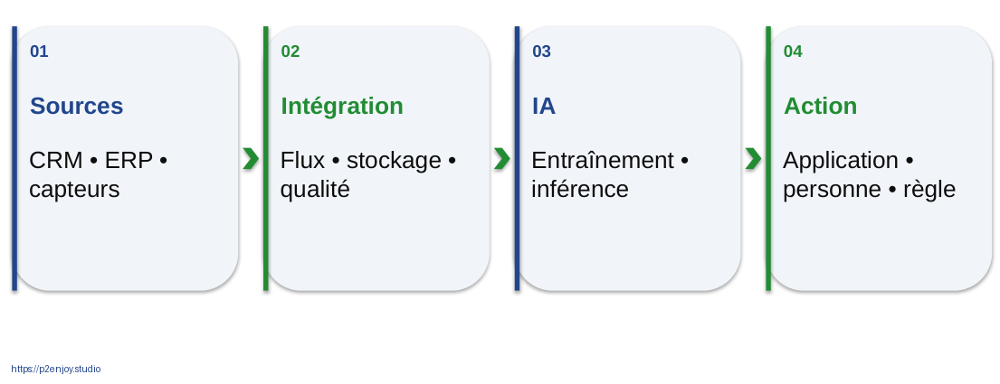

Figure J1-005. Partir d’une décision plutôt que d’un outil. Schéma pédagogique original, version éditable dans le PowerPoint.

## De la donnée à l’action

38,7 °C est une donnée. Pour interpréter cette température, il faut connaître le composant, les conditions de fonctionnement, le capteur et la plage attendue. L’information se construit lorsque la mesure est contextualisée. L’expertise et les modèles permettent ensuite de relier plusieurs observations à une hypothèse. L’action peut être une inspection, pas nécessairement un remplacement automatique.

La pyramide donnée, information, connaissance, décision est une représentation pédagogique. Elle ne signifie pas qu’un algorithme produit automatiquement une connaissance certaine. Dans l’entreprise, la qualité du contexte et la responsabilité de la décision restent déterminantes. Demander aux participants de remonter un exemple personnel depuis une observation jusqu’à un résultat vérifiable.

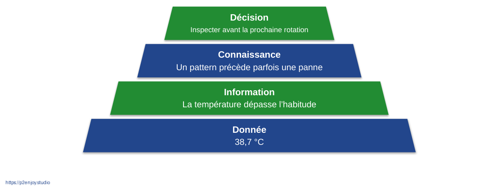

Figure J1-006. De la donnée à l’action. Schéma pédagogique original, version éditable dans le PowerPoint.

## IA, apprentissage automatique et apprentissage profond

L’intelligence artificielle est un champ qui comprend plusieurs méthodes de perception, prédiction, raisonnement, planification ou génération. Le Machine Learning désigne des approches qui ajustent un modèle à partir d’exemples au lieu d’exiger l’écriture explicite de toutes les règles. Dans l’apprentissage supervisé, les exemples sont associés à une cible ; sans cible explicite, d’autres approches recherchent des structures ou des anomalies.

Le Deep Learning est une famille du Machine Learning fondée sur des réseaux de neurones à plusieurs niveaux de représentation. L’IA générative décrit une capacité à produire du contenu et ne constitue pas un synonyme de toute l’IA. Une entreprise peut créer une forte valeur avec une régression, des arbres, un moteur de règles ou une prévision classique. Choisir la complexité seulement lorsqu’elle améliore une exigence réelle. [S02, S05, S06]

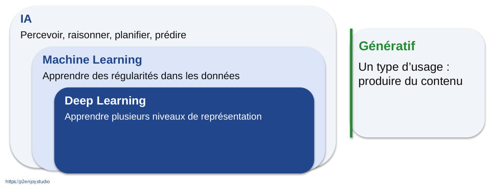

Figure J1-008. IA, apprentissage automatique et apprentissage profond. Schéma pédagogique original, version éditable dans le PowerPoint.

## Big Data et valeur des données

Le Big Data ne commence pas à un seuil universel de téraoctets. Volume, vélocité et variété peuvent obliger à adapter le stockage, les flux et les traitements. La grille des cinq V ajoute la véracité et la valeur pour ramener la discussion à la confiance et à la décision. Cette grille est une aide de lecture, pas une loi scientifique ou un label de performance.

Un petit jeu cohérent peut être plus utile qu’un immense historique sans définition stable ni finalité. Les données peuvent réduire un risque, un coût ou un délai, soutenir un service ou améliorer l’expérience. La valeur se vérifie dans l’action et son effet. Il faut donc distinguer volume disponible, droit d’utilisation, utilité prédictive et résultat métier. [S27]

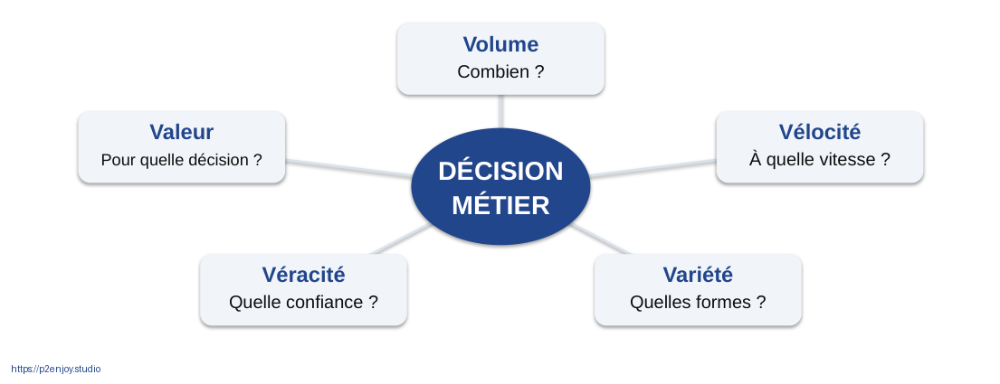

Figure J1-013. Big Data et valeur des données. Schéma pédagogique original, version éditable dans le PowerPoint.

## Entraîner n’est pas décider

L’entraînement utilise des exemples pour ajuster des paramètres. L’inférence applique le modèle à une nouvelle observation. La règle de décision combine ensuite le score avec les contraintes métier : capacité de traitement, criticité, coût des erreurs, contrôles et niveau de supervision. Cette troisième couche appartient au système, pas au modèle seul.

Pour prédire un départ dans trente jours, les caractéristiques doivent être connues à la date du score. La résiliation observée dans le futur peut servir à construire la cible historique, mais pas à alimenter le modèle comme si elle était disponible au moment de décider. Cette distinction temporelle est l’un des contrôles essentiels de validité. [S03]

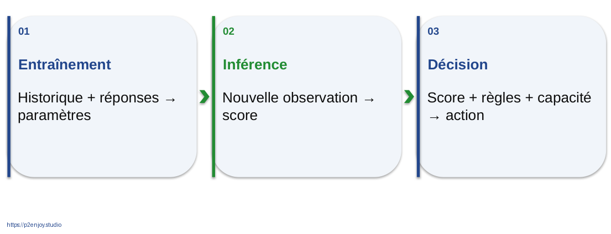

Figure J1-015. Entraîner n’est pas décider. Schéma pédagogique original, version éditable dans le PowerPoint.

## Mesurer les erreurs utiles au métier

Avec cent fraudes parmi dix mille paiements, une politique qui accepte tout obtient 99 % d’exactitude mais ne détecte aucune fraude. La précision mesure la proportion de cas pertinents parmi les alertes. Le rappel mesure la part des cas réels détectés. Un faux positif peut gêner un client légitime ; un faux négatif laisse passer le risque recherché.

Le coût ne se limite pas à la métrique statistique. Il comprend revue humaine, friction, perte éventuelle, délai, exploitation et capacité. Un seuil moins élevé augmente souvent le nombre d’alertes. Le bon choix dépend donc d’une politique explicite et d’une validation indépendante. Un score de risque n’est pas un effet causal et n’établit pas qu’une action de fidélisation sera efficace. [S04, S30]

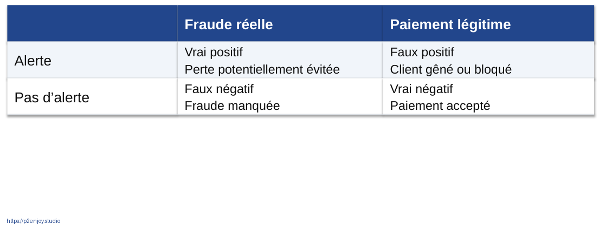

Figure J1-019. Mesurer les erreurs utiles au métier. Schéma pédagogique original, version éditable dans le PowerPoint.

## Le modèle continue à vivre après le notebook

Un notebook permet d’explorer, d’expliquer et de tester un raisonnement. La production exige en plus des flux fiables, des droits d’accès, des versions, des journaux, un service disponible et une procédure de retour arrière. La même préparation doit être appliquée en entraînement et en inférence. La responsabilité d’un incident doit être connue avant le premier déploiement.

Les données et les comportements changent. Surveiller les distributions ne remplace pas la mesure des résultats, et le réentraînement automatique n’est pas toujours la réponse adéquate. Une dérive peut venir d’une nouvelle politique métier, d’un capteur remplacé, d’une source erronée ou d’un changement de population. Il faut qualifier la cause et décider du contrôle adapté. [S28]

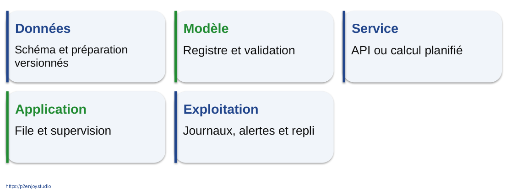

Figure J2-033. Le modèle continue à vivre après le notebook. Schéma pédagogique original, version éditable dans le PowerPoint.

# Cadre contractuel et conducteur vérifiable

[Durée : 720 minutes hors pauses] [TP : 450 minutes, 62,5 %] [Diagnostic et évaluations : 60 minutes] [Apports : 210 minutes]

Objectif général fourni : acquérir une compréhension approfondie des concepts et applications de l’intelligence artificielle dans les systèmes d’information des entreprises, avec un accent sur les impacts organisationnels et stratégiques.

Public : dirigeants, managers, responsables métiers, professionnels informatiques et data, personnes intéressées par l’impact de l’IA sur les SI. Prérequis : culture informatique et données ; notions SI souhaitées. Le niveau Application est matérialisé par la capacité à cadrer et justifier un usage dans une situation professionnelle.

| Bloc contractuel | Durée | Preuve d’apprentissage |
| --- | --- | --- |
| B1 : Big Data, Data Science et ML | 120 min | A01, A02 et diagnostic |
| B2 : données et modèles économiques | 120 min | A03, A04, A05 |
| B3 : Data Science et gouvernance | 120 min | A06, A07 |
| B4 : Machine Learning et Deep Learning | 180 min | A08, A09 |
| B5 : ouverture du SI | 180 min | A10, A11, A12 et évaluation |

Comptage  Les durées de séquence sont partagées entre plusieurs diapositives. Elles ne s’additionnent pas à chaque fiche. Les annexes sont des ressources complémentaires, pas des heures contractuelles supplémentaires.

## Conducteur du jour 1

| Séquence | Minutes | Modalité | Contenu |
| --- | --- | --- | --- |
| B1.1 | 15 | Évaluation | Diagnostic initial et attentes |
| B1.2 | 20 | Apport | SI, données et familles d’IA |
| B1.3 | 30 | TP | A01 : classer les cas métiers |
| B1.4 | 25 | Apport | Cycle data, entraînement et métriques |
| B1.5 | 30 | TP | A02 : cartographier Novalia |
| B2.1 | 15 | Apport | Données et création de valeur |
| B2.2 | 30 | TP | A03 : Netflix et Google Play |
| B2.3 | 15 | Apport | Fraude et coût des erreurs |
| B2.4 | 30 | TP | A04 : arbitrer les erreurs de fraude |
| B2.5 | 30 | TP | A05 : canevas de valeur métier |
| B3.1 | 20 | Apport | Gouvernance et qualité |
| B3.2 | 35 | TP | A06 : audit des données |
| B3.3 | 15 | Apport | Sécurité, RGPD et règlement IA |
| B3.4 | 45 | TP | A07 : RACI et risques |
| B3.5 | 5 | Évaluation | Récupération active de fin de journée |

Pauses et repas sont hors temps pédagogique. Le conducteur peut être positionné sur les horaires convenus pour la session ; aucun horaire contractuel ni client n’est inventé.

## Conducteur du jour 2

| Séquence | Minutes | Modalité | Contenu |
| --- | --- | --- | --- |
| B4.1 | 10 | Évaluation | Rappel actif et diagnostic technique |
| B4.2 | 20 | Apport | Cadrage ML et algorithmes |
| B4.3 | 40 | TP | A08a : explorer et entraîner |
| B4.4 | 20 | Apport | Validation, métriques et seuils |
| B4.5 | 35 | TP | A08b : choisir le seuil et tester |
| B4.6 | 20 | Apport | Apprentissage profond et production |
| B4.7 | 35 | TP | A09 : restitution Power BI |
| B5.1 | 20 | Apport | SI ouvert et modes d’échange |
| B5.2 | 45 | TP | A10 : architecture de flux |
| B5.3 | 20 | Apport | Contrats de données et sécurité API |
| B5.4 | 35 | TP | A11 : contrat et partage contrôlé |
| B5.5 | 30 | TP | A12 : gestion d’incidents |
| B5.6 | 30 | Évaluation | Restitution, QCM final et transfert individuel |

Pauses et repas sont hors temps pédagogique. Le conducteur peut être positionné sur les horaires convenus pour la session ; aucun horaire contractuel ni client n’est inventé.

## Préparation, différenciation et secours

Avant la session  Tester les notebooks de bout en bout ; préparer les CSV locaux et une copie des résultats ; vérifier le poste de projection, l’accès à Jupyter et la compatibilité du parc Power BI ; distribuer le cahier participant sans les corrigés.

Composition des groupes  Privilégier des équipes de trois à cinq profils mixtes. Managers : valeur et arbitrage. Métiers : workflow et action. IT : flux, identité, sécurité et repli. Data : validation et métriques. Tous travaillent sur le même cas.

Sans environnement Python  Distribuer les CSV et montrer le corrigé exécuté en masquant les réponses. Faire expliciter entrées, transformations et résultats. Ne pas consacrer le temps contractuel à une installation improvisée.

Sans Power BI ou sans Internet  Utiliser la maquette du diaporama et une lecture tabulaire des données. Tous les éléments essentiels sont locaux. Aucun compte fournisseur ni donnée confidentielle n’est nécessaire.

Après la session  Mettre à disposition les diaporamas PDF, les notebooks, les données, les corrigés et le corpus. Recueillir satisfaction et éléments de transfert sans les confondre avec une preuve d’impact économique.

# Fondamentaux et mise en application métier

[Bloc : B1] [Niveau : Application] [Fiches synchronisées avec les identifiants des diapositives]

## J1-002 | Ce que vous saurez faire

[Séquence : B1.1] [Modalité : Évaluation] [Budget de la séquence : 15 min]

Cadrer. Une décision et un objectif

Relier. Données, modèle et SI

Arbitrer. Erreurs, valeur et risques

Concevoir. Un usage métier vérifiable

Le niveau Application vise une utilisation du raisonnement, pas une récitation. À la fin, chacun devra justifier un choix de données, de métriques et d’intégration. Une réponse comme « mettre de l’IA dans le CRM » n’est pas suffisante. Demander qui reçoit un résultat, à quel moment et quelle action change. Les livrables des ateliers constituent les preuves, tandis que les quiz vérifient individuellement le vocabulaire.

Question de relance  Quelle décision répétitive voudriez-vous mieux prendre ?

Réponse attendue  Une décision observable et située dans un processus, par exemple prioriser une file de tickets.

Message à faire retenir  Le résultat attendu est une capacité d’application, pas une expertise de chercheur.

Sources : [S01] Référentiel et dossier fournis par Martino

## J1-003 | Deux journées, cinq blocs contractuels

[Séquence : B1.1] [Modalité : Évaluation] [Budget de la séquence : 15 min]

J1 • 2 h. Fondamentaux et cas métiers

J1 • 2 h. Données et modèles économiques

J1 • 2 h. Data Science et gouvernance

J2 • 3 h. Machine Learning et Deep Learning

J2 • 3 h. Ouverture du SI et stratégie

Les durées sont des temps pédagogiques hors pauses. Le conducteur totalise exactement 720 minutes. Les travaux pratiques représentent 450 minutes, soit 62,5 %. Les activités au sens large, en incluant diagnostic et évaluations, représentent 510 minutes, soit 70,8 %. Ne pas confondre les deux indicateurs. Les annexes de perfectionnement et les corrigés ne sont pas des heures supplémentaires obligatoires.

Message à faire retenir  7 h 30 de TP effectifs, plus 1 h de diagnostic et d’évaluation.

Sources : [S01] Référentiel et dossier fournis par Martino

## J1-004 | Diagnostic : cinq questions avant de commencer

[Séquence : B1.1] [Modalité : Évaluation] [Budget de la séquence : 15 min]

01. Une API est-elle une intelligence artificielle ?

02. Entraîner et utiliser un modèle : même opération ?

03. 99 % d’exactitude prouve-t-il la qualité ?

04. Plus de données signifie-t-il toujours plus de valeur ?

05. Un score de risque est-il une décision ?

Laisser trois minutes de réponse individuelle, quatre minutes de confrontation en binômes, puis corriger sans notation sanctionnante. Relever surtout le degré de certitude. Une réponse fausse mais argumentée est un point d’appui pédagogique. Conserver les réponses pour comparer avec le QCM final. Ne pas demander de partager des exemples confidentiels issus d’employeurs.

Question de relance  Pour quelle réponse êtes-vous le moins certain ?

Réponse attendue  Toutes les propositions appellent une distinction : API/interface ; entraînement/ajustement ; inférence/utilisation ; exactitude insuffisante ; valeur conditionnelle ; décision organisée.

Message à faire retenir  Répondez d’abord seul, puis confrontez votre raisonnement.

## J1-005 | Un modèle n’est qu’un maillon du SI

[Séquence : B1.2] [Modalité : Apport] [Budget de la séquence : 20 min]

Sources. CRM • ERP • capteurs

Intégration. Flux • stockage • qualité

IA. Entraînement • inférence

Action. Application • personne • règle

Partir d’un exemple familier : une demande client entre dans un outil, elle est associée à un compte, routée vers une équipe et traitée. L’IA peut aider au routage, mais elle ne remplace ni l’identité du client, ni les droits d’accès, ni la gestion du dossier. Un SI associe personnes, procédures, données, applications et infrastructures. Dessiner les éléments humains au même niveau que les logiciels pour éviter une lecture uniquement technique.

Figure J1-005. Un modèle n’est qu’un maillon du SI. Schéma pédagogique original, version éditable dans le PowerPoint.

Question de relance  Que se passe-t-il si le score reste dans un fichier que personne ne consulte ?

Réponse attendue  La prédiction peut être techniquement valide sans produire d’action ni de valeur.

Message à faire retenir  L’IA reçoit des données et rend un résultat à un processus.

## J1-006 | De l’observation à l’action

[Séquence : B1.2] [Modalité : Apport] [Budget de la séquence : 20 min]

Décision. Inspecter avant la prochaine rotation

Connaissance. Un pattern précède parfois une panne

Information. La température dépasse l’habitude

Donnée. 38,7 °C

La pyramide est une grille de lecture pédagogique, pas une loi universelle de la connaissance. La température seule ne dit pas s’il y a un problème : il faut connaître le composant, son régime normal et la fiabilité du capteur. Une corrélation entre un pattern et une panne peut guider une inspection sans constituer une explication physique complète. Faire remonter chaque exemple métier depuis une observation concrète jusqu’à une action.

Figure J1-006. De l’observation à l’action. Schéma pédagogique original, version éditable dans le PowerPoint.

Question de relance  Quelle information manque pour interpréter 38,7 °C ?

Réponse attendue  Le système mesuré, le contexte, la plage attendue et la qualité de la mesure.

Message à faire retenir  Le contexte transforme une donnée en information exploitable.

## J1-007 | Quatre objets à ne pas confondre

[Séquence : B1.2] [Modalité : Apport] [Budget de la séquence : 20 min]

Donnée. Une observation disponible dans un contexte.

Algorithme. Une procédure de calcul ou d’apprentissage.

Modèle. Une représentation paramétrée obtenue ou construite.

Système IA. Le modèle, ses interfaces et son dispositif d’usage.

Un algorithme d’apprentissage appliqué à deux historiques peut produire deux modèles différents. Le système déployé ajoute les transformations, les règles d’accès, les outils et la supervision. Une erreur peut naître dans n’importe laquelle de ces couches. Utiliser l’analogie de la recette, du plat préparé et du service de restauration, sans la prolonger au point de masquer les différences techniques.

Question de relance  Changer les données sans changer l’algorithme peut-il changer le résultat ?

Réponse attendue  Oui : le modèle dépend des exemples, des paramètres de calcul et du protocole.

Message à faire retenir  Identifier la couche concernée évite les diagnostics imprécis.

Sources : [S02] scikit-learn : guide utilisateur

## J1-008 | IA, apprentissage automatique, apprentissage profond

[Séquence : B1.2] [Modalité : Apport] [Budget de la séquence : 20 min]

IA. Percevoir, raisonner, planifier, prédire

Machine Learning. Apprendre des régularités dans les données

Deep Learning. Apprendre plusieurs niveaux de représentation

Génératif. Un type d’usage : produire du contenu

Les ensembles montrent une relation d’inclusion entre IA, apprentissage automatique et apprentissage profond. L’IA générative décrit une famille de fonctions ; les systèmes génératifs actuels reposent souvent sur des architectures profondes, sans que toute génération soit par définition du Deep Learning. Il existe aussi des systèmes de règles et d’optimisation. Ne pas employer « intelligence » comme preuve de compréhension humaine.

Figure J1-008. IA, apprentissage automatique, apprentissage profond. Schéma pédagogique original, version éditable dans le PowerPoint.

Question de relance  Un filtre de fraude est-il moins « IA » parce qu’il ne discute pas ?

Réponse attendue  Non. Classification et détection peuvent répondre pleinement au besoin sans interface conversationnelle.

Message à faire retenir  L’IA d’entreprise ne se réduit pas au chatbot.

Sources : [S02] scikit-learn : guide utilisateur ; [S05] LeCun, Bengio et Hinton : apprentissage profond

## J1-009 | La bonne famille dépend de la question

[Séquence : B1.2] [Modalité : Apport] [Budget de la séquence : 20 min]

| Question | Famille | Sortie |
| --- | --- | --- |
| Combien ? | Régression / prévision | Quantité |
| Oui ou non ? | Classification | Classe ou score |
| Qui se ressemble ? | Regroupement | Groupes |
| Que proposer ? | Recommandation | Liste ordonnée |
| Que produire ? | Génération | Contenu |

Demander aux participants de formuler une question avant de nommer un algorithme. Une prévision de ventes et une classification de tickets ne se valident pas avec les mêmes métriques. Un problème peut combiner plusieurs familles : un service recommande une action après avoir prédit un risque. Pour une prévision temporelle, l’horizon, la saisonnalité et l’absence de données futures sont déterminants.

Question de relance  « Réduire les pannes » définit-il déjà une cible de modèle ?

Réponse attendue  Non. Il faut préciser équipement, horizon et événement observable.

Message à faire retenir  La formulation du problème est déjà une décision technique.

Sources : [S02] scikit-learn : guide utilisateur

## J1-010 | A01 • Classer huit situations métier

[Séquence : B1.3] [Modalité : TP] [Budget de la séquence : 30 min]

Mission. Associez chaque cas à une famille de traitement.

Méthode. Seul 5 min → groupe 15 min → justification 10 min.

Livrable. Fiche A01 : cible, sortie attendue, donnée nécessaire.

Réussite. Justifier au moins six associations sans jargon vide.

Distribuer la fiche A01. Former des groupes mixtes de trois à cinq personnes. Chaque carte possède une question et non un nom de technologie. Accepter une alternative lorsqu’elle est correctement cadrée : l’anomalie peut être supervisée si l’historique comporte des labels suffisamment fiables. Faire expliciter le cas où de simples règles suffisent. Ne pas imposer l’IA comme réponse à toutes les cartes.

Question de relance  Quelle carte peut être traitée sans apprentissage ?

Réponse attendue  Une alerte imposée par une règle explicite et stable, par exemple une facture dépassant un seuil contractuel.

Message à faire retenir  30 minutes • Cahier A01 • Réponse argumentée, pas mot-clé.

## J1-011 | Les cartes à répartir

[Séquence : B1.3] [Modalité : TP] [Budget de la séquence : 30 min]

Finance. Détecter des paiements suspects.

Support. Affecter un ticket à une équipe.

Marketing. Anticiper un départ dans 30 jours.

Commerce. Recommander trois articles.

Opérations. Prévoir le volume de demain.

IT / RH. Repérer des incidents ; classer des documents.

Les cartes détaillées du cahier ajoutent une segmentation de clients et une règle de dépassement de seuil. Demander pour chaque choix ce qui constituerait une bonne et une mauvaise réponse. Les profils RH doivent distinguer l’organisation documentaire d’une décision de recrutement affectant une personne. Faire noter les informations manquantes plutôt que d’inventer une cible précise.

Question de relance  Une anomalie est-elle nécessairement une fraude ?

Réponse attendue  Non. Une anomalie est un signal inhabituel ; l’enquête ou un label permet de qualifier la fraude.

Message à faire retenir  Une même technique peut servir plusieurs métiers, avec des risques différents.

Sources : [S02] scikit-learn : guide utilisateur

## J1-012 | Corriger en explicitant les hypothèses

[Séquence : B1.3] [Modalité : TP] [Budget de la séquence : 30 min]

Réponse superficielle. « Un réseau de neurones pour tout. »
Aucune cible, aucune donnée, aucune action.

Réponse exploitable. « Classer les tickets selon l’équipe, à partir du texte historique étiqueté, avec revue des cas incertains. »

Faire comparer deux formulations. Une réponse utile indique unité, données, cible et destinataire. Le nom du modèle peut attendre. Si les catégories historiques sont incohérentes, le modèle ne résout pas ce problème de gouvernance : il peut le reproduire. Introduire le coût des erreurs avec un ticket urgent routé vers une équipe indisponible.

Question de relance  Que faut-il vérifier avant d’utiliser les catégories historiques ?

Réponse attendue  Leur stabilité, leur qualité, les changements d’organisation et la manière dont elles ont été attribuées.

Message à faire retenir  Une hypothèse explicite vaut mieux qu’un choix technologique prématuré.

## J1-013 | Big Data : cinq questions, pas un seuil magique

[Séquence : B1.4] [Modalité : Apport] [Budget de la séquence : 25 min]

Volume. Combien ?

Vélocité. À quelle vitesse ?

Variété. Quelles formes ?

Véracité. Quelle confiance ?

Valeur. Pour quelle décision ?

Le NIST propose des architectures et taxonomies pour traiter les contraintes liées aux données massives. Les cinq V affichés sont une mnémotechnique d’animation, pas une définition normative unique. Un fichier modeste mais très frais peut être plus utile qu’un historique massif et obsolète. À l’inverse, la volumétrie peut imposer des traitements distribués. Faire décrire la contrainte réellement rencontrée avant de citer une plateforme.

Figure J1-013. Big Data : cinq questions, pas un seuil magique. Schéma pédagogique original, version éditable dans le PowerPoint.

Question de relance  Pourquoi un milliard de lignes peut-il n’avoir aucune valeur ?

Réponse attendue  Parce qu’aucune décision utile, aucun droit d’usage ou aucune qualité exploitable ne sont établis.

Message à faire retenir  Le volume est une contrainte ; la valeur est une finalité.

Sources : [S27] NIST : architecture de référence Big Data

## J1-014 | La Data Science est un processus collectif

[Séquence : B1.4] [Modalité : Apport] [Budget de la séquence : 25 min]

Cadrer. Décision et hypothèse

Préparer. Données et qualité

Comparer. Référence et modèle

Intégrer. Application et utilisateurs

Mesurer. Résultat et erreurs

Réviser. Contexte et limites

Le modèle n’occupe qu’une partie du cycle. La préparation, la définition d’un indicateur utile et le suivi peuvent mobiliser des métiers différents. Une bonne démarche est itérative : si l’action est impossible ou les données indisponibles à temps, on revient au cadrage. Le cycle n’impose pas de développer un nouveau modèle : il peut conclure à une règle simple, un tableau de bord ou l’abandon du cas.

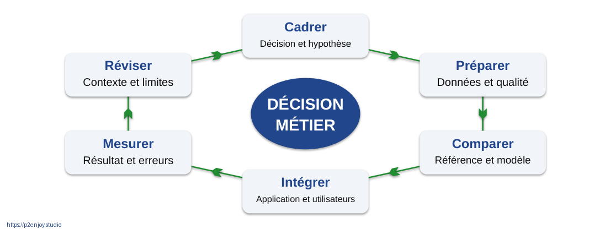

Figure J1-014. La Data Science est un processus collectif. Schéma pédagogique original, version éditable dans le PowerPoint.

Question de relance  À quelle étape décide-t-on de ne pas utiliser l’IA ?

Réponse attendue  Dès le cadrage, puis à chaque revue si les preuves de valeur ou de faisabilité manquent.

Message à faire retenir  Un projet data commence par une question et se juge sur un résultat.

Sources : [S02] scikit-learn : guide utilisateur ; [S28] Sculley et al. : dette technique des systèmes ML

## J1-015 | Entraînement, inférence, décision

[Séquence : B1.4] [Modalité : Apport] [Budget de la séquence : 25 min]

Entraînement. Historique + réponses → paramètres

Inférence. Nouvelle observation → score

Décision. Score + règles + capacité → action

Décrire trois moments séparés. Pendant l’entraînement, les paramètres changent selon les données et le critère choisi. À l’inférence, le modèle fixé transforme une observation nouvelle. La décision ajoute un seuil, des exclusions, une capacité de traitement et éventuellement une supervision humaine. Une requête d’inférence n’entraîne pas automatiquement le modèle ; ce comportement dépend du système et de ses flux explicites.

Figure J1-015. Entraînement, inférence, décision. Schéma pédagogique original, version éditable dans le PowerPoint.

Question de relance  Le modèle décide-t-il seul de contacter le client ?

Réponse attendue  Il calcule un score. La politique d’action appartient à l’organisation et doit être attribuée.

Message à faire retenir  Un score n’a pas de politique commerciale implicite.

Sources : [S02] scikit-learn : guide utilisateur ; [S30] scikit-learn : choix du seuil de décision

## J1-016 | Ce qui est disponible au moment de décider

[Séquence : B1.4] [Modalité : Apport] [Budget de la séquence : 25 min]

Avant t₀. Historique observé

t₀. Calcul du score

Après t₀. Résiliation éventuelle

t₀ + 30 j. Mesure de la cible

La frontière temporelle est la règle la plus utile pour éviter les fuites de données. On ne peut pas prédire un départ trente jours avant en utilisant une date connue seulement après le signal de résiliation. Les agrégats doivent également respecter cette frontière. Une colonne nommée « nombre de tickets » peut contenir des tickets futurs si elle est recalculée a posteriori. La disponibilité doit être prouvée, pas supposée à partir du nom.

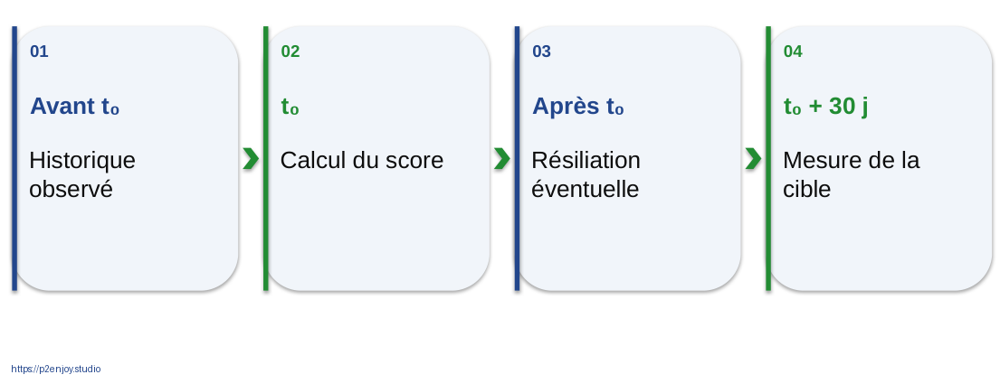

Figure J1-016. Ce qui est disponible au moment de décider. Schéma pédagogique original, version éditable dans le PowerPoint.

Question de relance  Une date de demande de résiliation est-elle toujours interdite ?

Réponse attendue  Pas toujours : cela dépend du moment et de la décision. Pour le cas de prédiction précoce défini ici, elle est postérieure et exclue.

Message à faire retenir  Chaque variable doit exister avant la décision à améliorer.

Sources : [S03] scikit-learn : pièges et fuites de données

## J1-017 | Généraliser plutôt que mémoriser

[Séquence : B1.4] [Modalité : Apport] [Budget de la séquence : 25 min]

Trop simple. La tendance est manquée

Ajusté. La structure utile est captée

Trop complexe. Le bruit est mémorisé

Utiliser l’analogie d’un examen appris par cœur. Le score sur les exemples déjà vus ne prouve pas la capacité à traiter de nouveaux cas. Les courbes sont schématiques, sans mesures réelles. Un modèle très complexe n’est pas mauvais par nature ; le risque dépend des données, du réglage et de la validation. Faire comprendre pourquoi un jeu de test doit rester indépendant des choix.

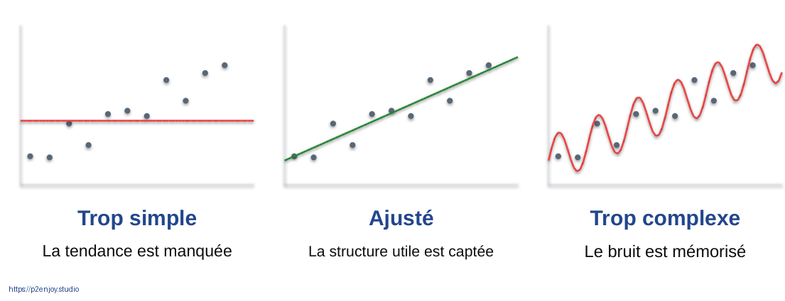

Figure J1-017. Généraliser plutôt que mémoriser. Schéma pédagogique original, version éditable dans le PowerPoint.

Question de relance  Pourquoi ne pas entraîner sur toutes les données puis afficher ce même score ?

Réponse attendue  Parce qu’on mesurerait en partie la mémorisation et non la généralisation.

Message à faire retenir  La performance utile se mesure sur des situations non utilisées pour choisir.

Sources : [S29] scikit-learn : validation croisée

## J1-018 | 99 % peut signifier zéro fraude détectée

[Séquence : B1.4] [Modalité : Apport] [Budget de la séquence : 25 min]

99 %  d’exactitude, malgré un rappel nul

Faire calculer : sur dix mille paiements dont cent fraudes, prédire « légitime » pour tous donne 9 900 bonnes classes sur 10 000. Ce résultat paraît impressionnant mais manque toutes les fraudes. Les chiffres sont un exemple arithmétique inventé. Introduire la notion de prévalence et demander quelle erreur coûte à l’entreprise et au client.

Question de relance  Quel indicateur manque ici ?

Réponse attendue  Le rappel de la fraude, et plus largement la précision, les faux positifs et leurs conséquences.

Message à faire retenir  Exactitude = 9 900 / 10 000. Rappel de la fraude = 0 / 100.

Sources : [S04] scikit-learn : métriques et scores

## J1-019 | Quatre issues, quatre conséquences

[Séquence : B1.4] [Modalité : Apport] [Budget de la séquence : 25 min]

|  | Fraude réelle | Paiement légitime |
| --- | --- | --- |
| Alerte | Vrai positif Perte potentiellement évitée | Faux positif Client gêné ou bloqué |
| Pas d’alerte | Faux négatif Fraude manquée | Vrai négatif Paiement accepté |

Lire la matrice avec la même convention tout au long du cours. Les lignes expriment ici l’action du système et les colonnes la réalité. Les bibliothèques peuvent utiliser une orientation différente : toujours lire les libellés. Un vrai positif n’est une perte évitée que si l’action est efficace ; détecter sans traiter ne suffit pas. Un faux positif peut occasionner une revue, pas nécessairement un blocage.

Figure J1-019. Quatre issues, quatre conséquences. Schéma pédagogique original, version éditable dans le PowerPoint.

Question de relance  Pourquoi les faux positifs ne sont-ils pas seulement un problème statistique ?

Réponse attendue  Ils consomment du temps, dégradent l’expérience et peuvent faire perdre une vente.

Message à faire retenir  Précision : fiabilité des alertes. Rappel : couverture des cas réels.

Sources : [S04] scikit-learn : métriques et scores

## J1-020 | Novalia : une entreprise fictive, un SI concret

[Séquence : B1.5] [Modalité : TP] [Budget de la séquence : 30 min]

CRM. Clients et interactions

ERP. Commandes, stock, factures

Support. Tickets et catégories

Web. Navigation et commandes

Données. Consolidation analytique

Partenaires. Paiement et livraison

Novalia est une entreprise pédagogique combinant services par abonnement et vente en ligne. Les participants choisissent un processus qui reste commun à tous les ateliers. Ne pas inventer de résultats réels pour cette entreprise. Les données fournies au TP portent sur des clients synthétiques indépendants. La carte est volontairement simplifiée pour permettre de discuter les responsabilités et les flux sans enseigner un produit d’architecture particulier.

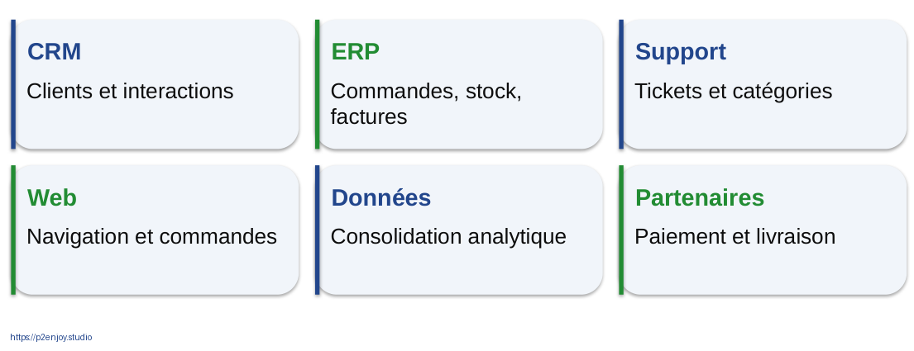

Figure J1-020. Novalia : une entreprise fictive, un SI concret. Schéma pédagogique original, version éditable dans le PowerPoint.

Question de relance  Quel système devra recevoir un score de départ ?

Réponse attendue  Le CRM ou une file opérationnelle utilisée par l’équipe fidélisation, avec une date et une règle d’action.

Message à faire retenir  Le cas fil rouge est synthétique et ne représente aucun client.

## J1-021 | A02 • Dessiner la chaîne de décision

[Séquence : B1.5] [Modalité : TP] [Budget de la séquence : 30 min]

Mission. Choisir une décision Novalia à améliorer.

Production. Tracer source → préparation → score → action → mesure.

Contraintes. Nommer un utilisateur et une donnée indisponible.

Critère. Chaque flèche doit représenter un échange compréhensible.

Consacrer cinq minutes au choix, quinze au dessin et dix au retour croisé. Interdire les boîtes simplement intitulées « IA magique ». Chaque groupe annote la fréquence d’arrivée des données et le responsable de l’action. Demander à un autre groupe de suivre un exemple de bout en bout. Si ce parcours est impossible, le dessin doit être clarifié.

Question de relance  Où mesurer l’amélioration finale ?

Réponse attendue  Après l’action métier, par exemple délai de traitement, coût ou départ observé, pas seulement à la sortie du modèle.

Message à faire retenir  30 minutes • Cahier A02 • Cinq blocs et un responsable.

## J1-022 | Débrief : le score doit atteindre quelqu’un

[Séquence : B1.5] [Modalité : TP] [Budget de la séquence : 30 min]

Historique. Usage et incidents

Préparation. Variables disponibles

Score. Risque de départ

File CRM. Cas prioritaires

Résultat. Action et départ observé

Exemple de correction possible, non architecture imposée : un calcul nocturne est suffisant si l’équipe travaille les dossiers le matin. Le score est relié à une version du modèle et à un instant. Les cas nécessitant une action non autorisée sont exclus par des règles. L’observation finale permet d’évaluer la performance et l’impact. La flèche de retour n’autorise pas un réentraînement automatique non contrôlé.

Question de relance  La donnée « résultat de campagne » doit-elle être conservée ?

Réponse attendue  Elle peut être nécessaire pour mesurer l’effet, avec une finalité, une durée, des accès et un protocole définis.

Message à faire retenir  La boucle de mesure ferme le système, pas seulement le diagramme.

# Données et nouveaux modèles économiques

[Bloc : B2] [Niveau : Application] [Fiches synchronisées avec les identifiants des diapositives]

## J1-024 | Six mécanismes de création de valeur

[Séquence : B2.1] [Modalité : Apport] [Budget de la séquence : 15 min]

Revenus. Mieux recommander

Coûts. Mieux planifier

Risque. Mieux détecter

Expérience. Mieux orienter

Service. Mieux accompagner

Écosystème. Mieux partager

Présenter les mécanismes comme une grille d’analyse. Un même projet peut améliorer plusieurs dimensions mais doit choisir un indicateur principal pour éviter une justification vague. Une augmentation de conversion peut dégrader une marge si elle repose sur trop de remises. Une baisse du temps de traitement peut réduire la qualité si l’on ferme les dossiers trop vite. Faire demander un indicateur de protection en parallèle du KPI principal.

Question de relance  Quel effet négatif surveiller si vous optimisez seulement la rapidité ?

Réponse attendue  Erreurs, réouvertures, insatisfaction ou transfert de charge vers une autre équipe.

Message à faire retenir  Associer un indicateur principal à un indicateur de protection.

## J1-025 | La valeur n’est pas stockée dans le fichier

[Séquence : B2.1] [Modalité : Apport] [Budget de la séquence : 15 min]

Donnée. Un signal disponible

Analyse. Une interprétation

Décision. Un choix possible

Action. Un changement réel

Impact. Un résultat attribuable

Expliquer la différence entre un résultat de modèle et un résultat économique. Un score peut être exact mais arriver trop tard. Une équipe peut ignorer le résultat ou manquer de capacité. Une action peut être inefficace malgré une bonne prédiction. La démonstration de valeur exige donc une comparaison crédible avec la situation sans le dispositif. Ne pas confondre revenu associé à un client et revenu sauvé par une intervention.

Question de relance  Pourquoi 1 million d’euros de clients à risque n’est-il pas 1 million d’euros de gains ?

Réponse attendue  Tous ne partiront pas, tous ne seront pas joignables et toutes les actions ne changeront pas leur décision.

Message à faire retenir  La causalité métier ne se déduit pas d’un score prédictif.

## J1-026 | Coût complet : regarder au-delà du modèle

[Séquence : B2.1] [Modalité : Apport] [Budget de la séquence : 15 min]

Construire. Cadrage, collecte, préparation, intégration.

Exploiter. Calcul, supervision, mises à jour, incidents.

Faire adopter. Formation, processus, support, accompagnement.

Gouverner. Sécurité, droits, contrats, réversibilité.

Faire lister les coûts absents d’une simple facture d’API ou d’un entraînement. Une solution existante peut être moins chère à construire mais exiger des contrats, des interfaces et un suivi. Une solution locale peut réduire certains transferts tout en augmentant la charge d’exploitation. Il ne s’agit pas de conseiller un achat : on enseigne un périmètre de calcul complet. Les coûts d’erreur font partie du cas économique.

Question de relance  Quel coût disparaît rarement après la fin du prototype ?

Réponse attendue  Maintenance, évolution des données, exploitation et responsabilité du service.

Message à faire retenir  Le coût d’un système IA se mesure sur son cycle de vie.

Sources : [S28] Sculley et al. : dette technique des systèmes ML

## J1-027 | Netflix : une recommandation est un système

[Séquence : B2.2] [Modalité : TP] [Budget de la séquence : 30 min]

Besoin. Aider une personne à trouver un contenu pertinent.

Mécanisme. Plusieurs algorithmes, sélection et classement.

Validation. Relier l’expérience à l’expérimentation.

Limite. Article de 2015, pas photographie complète de 2026.

Le papier de Gomez-Uribe et Hunt présente le système Netflix comme une composition d’algorithmes liée à une finalité économique et à l’expérimentation. L’architecture détaillée affichée ensuite est une adaptation pédagogique, pas un plan technique officiel de production. Demander au groupe de distinguer pertinence d’un contenu, ordre de présentation et expérience vécue. La finalité n’est pas de produire un score isolé mais de faciliter un choix utilisateur.

Question de relance  Une amélioration hors ligne garantit-elle une meilleure expérience ?

Réponse attendue  Non. Il faut observer un indicateur utilisateur et vérifier le protocole de test.

Message à faire retenir  Cas documenté • Entreprise : Netflix • Publication scientifique historique

Sources : [S07] Gomez-Uribe et Hunt : le système de recommandation Netflix

## J1-028 | Du catalogue à la liste recommandée

[Séquence : B2.2] [Modalité : TP] [Budget de la séquence : 30 min]

Candidats. Quels contenus considérer ?

Scores. Quelle pertinence estimée ?

Classement. Dans quel ordre ?

Contraintes. Diversité et disponibilité

Interface. Ce qui est réellement vu

Demander à chaque équipe d’annoter une étape par une source de données et une erreur possible. Une bonne sélection peut être annulée par une règle qui exclut trop de contenus. L’interface détermine l’exposition et influence les futures données. Ce schéma générique est inspiré des recommendeurs documentés, sans prétendre représenter l’architecture propriétaire exacte de Netflix. Faire imaginer le même enchaînement pour un catalogue B2B.

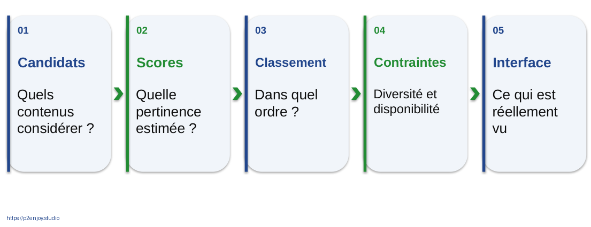

Figure J1-028. Du catalogue à la liste recommandée. Schéma pédagogique original, version éditable dans le PowerPoint.

Question de relance  Pourquoi les données futures dépendent-elles aussi de l’interface ?

Réponse attendue  Les utilisateurs interagissent avec ce qu’on leur montre ; l’exposition crée une boucle de rétroaction.

Message à faire retenir  Architecture pédagogique, non schéma propriétaire de Netflix.

Sources : [S07] Gomez-Uribe et Hunt : le système de recommandation Netflix

## J1-029 | Google Play : mémoriser et généraliser

[Séquence : B2.2] [Modalité : TP] [Budget de la séquence : 30 min]

Voie large. Associations de caractéristiques déjà utiles.

Voie profonde. Représentations apprises et combinaisons nouvelles.

Combinaison. Un score confronté à un résultat en ligne.

L’étude Wide & Deep de 2016 combine un modèle large et un réseau profond. Le point pédagogique n’est pas de reproduire l’infrastructure de Google mais de comprendre deux fonctions complémentaires. Les résultats en ligne rapportent une amélioration des acquisitions d’applications par rapport aux deux branches prises séparément. Ne pas présenter les volumes de 2016 comme les volumes actuels. Faire rapprocher cette combinaison des besoins de stabilité et de découverte dans un catalogue.

Question de relance  Pourquoi ne pas choisir la branche la plus sophistiquée par principe ?

Réponse attendue  Parce que les propriétés utiles et les résultats observés, non le prestige de la méthode, doivent guider le choix.

Message à faire retenir  Cas documenté • 2016 • L’expérimentation départage les approches.

Sources : [S08] Cheng et al. : Wide & Deep pour la recommandation

## J1-030 | A03 • Comparer deux moteurs de recommandation

[Séquence : B2.2] [Modalité : TP] [Budget de la séquence : 30 min]

Travail. Netflix et Google Play : même finalité, structures différentes.

À documenter. Données → mécanisme → interface → mesure.

Question critique. Quel effet non souhaité surveiller ?

Restitution. Une proposition transposable à Novalia, sans chiffre promis.

Les trente minutes incluent la lecture des cartes de cas : huit minutes de lecture, douze d’analyse, dix de restitution. Les chiffres de résultats sont des éléments de contexte, pas des objectifs de performance pour le groupe. Attendre au moins un KPI de pertinence ou d’acquisition et une mesure de protection comme la diversité ou la satisfaction. Un groupe qui propose seulement un taux de clic doit expliquer pourquoi ce clic correspond à de la valeur.

Question de relance  Que transférer plutôt que copier ?

Réponse attendue  La décomposition du système, l’attention à l’interface et la validation de l’impact.

Message à faire retenir  30 minutes, lecture des cas incluse • Cahier A03

Sources : [S07] Gomez-Uribe et Hunt : le système de recommandation Netflix ; [S08] Cheng et al. : Wide & Deep pour la recommandation

## J1-031 | Stripe Radar : la fraude face à la conversion

[Séquence : B2.3] [Modalité : Apport] [Budget de la séquence : 15 min]

70 000 Md. Points de données annoncés par Stripe.

32 %. Réduction moyenne de fraude annoncée.

Décision. Accepter, vérifier ou bloquer.

Prudence. Résultats fournisseur, pas garantie pour Novalia.

Les deux chiffres proviennent de la page Stripe consultée pour le support. Ils doivent rester accompagnés du statut « déclaré par le fournisseur ». L’exercice suivant n’utilise pas ces chiffres : il repose sur un scénario explicitement inventé. Le cas montre comment une plateforme combine signaux et score pour alimenter une décision rapide. Le bénéfice doit être confronté au coût des paiements légitimes perturbés.

Question de relance  Pourquoi bloquer toutes les transactions ne résout-il pas économiquement la fraude ?

Réponse attendue  On supprime aussi les ventes légitimes ; le résultat doit préserver conversion et expérience.

Message à faire retenir  Cas documenté • Chiffres Stripe consultés le 14 septembre 2026

Sources : [S10] Stripe Radar : données et performance déclarées

## J1-032 | Le coût des erreurs dépend du contexte

[Séquence : B2.3] [Modalité : Apport] [Budget de la séquence : 15 min]

Faux positif. Un paiement légitime est signalé.
Coût : revue, abandon, insatisfaction.

Faux négatif. Une fraude n’est pas signalée.
Coût : perte, traitement et risque.

Inviter deux groupes à défendre des seuils différents selon les montants et le niveau de friction acceptable. Le faux positif ne coûte pas toujours le montant total de la transaction ; l’exercice fixe une hypothèse simple afin de rendre le calcul possible. Il faut aussi compter les coûts communs d’exploitation pour comparer des systèmes différents. La même méthode peut être appliquée à un contrôle de facture ou à une inspection industrielle.

Question de relance  La meilleure politique est-elle la même pour une alerte et pour un blocage automatique ?

Réponse attendue  Non. Le coût et la réversibilité de l’action modifient le compromis.

Message à faire retenir  Mesurer une erreur exige de décrire l’action qu’elle déclenche.

Sources : [S04] scikit-learn : métriques et scores ; [S30] scikit-learn : choix du seuil de décision

## J1-033 | Trois niveaux de mesure

[Séquence : B2.3] [Modalité : Apport] [Budget de la séquence : 15 min]

Modèle. Précision, rappel, calibration, erreurs par segment.

Système. Latence, disponibilité, fraîcheur et coûts.

Métier. Pertes évitées, conversion, satisfaction, charge.

Un système peut réussir un niveau et échouer sur un autre. Un bon modèle lent peut arriver après l’autorisation du paiement. Une API rapide peut servir des données périmées. Une meilleure détection peut saturer une équipe de revue. Demander un responsable et un seuil d’alerte pour chaque niveau. Les seuils sont des choix de conception à justifier, pas des chiffres universels.

Question de relance  Qui décide du niveau de faux positifs acceptable ?

Réponse attendue  Le responsable métier avec les équipes risque, conformité et exploitation selon le contexte.

Message à faire retenir  KPI du modèle ≠ KPI du service ≠ KPI de valeur.

## J1-034 | A04 • Quelle politique de fraude retenir ?

[Séquence : B2.4] [Modalité : TP] [Budget de la séquence : 30 min]

| Scénario fictif | Politique A | Politique B |
| --- | --- | --- |
| Fraudes détectées | 80 | 65 |
| Fraudes manquées | 20 | 35 |
| Alertes légitimes | 400 | 100 |
| Coût d’une fraude manquée | 100 € | 100 € |
| Coût d’une fausse alerte | 5 € | 5 € |

Distribuer la fiche A04. La population comporte cent fraudes et 9 900 paiements légitimes. Le coût du faux positif est fixé à cinq euros et celui du faux négatif à cent euros ; tous les autres coûts sont supposés égaux pour la comparaison. Faire calculer coût, précision et rappel par groupe. Puis changer un paramètre pour montrer qu’il n’existe pas de seuil optimal indépendant du métier.

Question de relance  Calculez le coût de A et de B. Quel critère autre que le total faut-il discuter ?

Réponse attendue  A : 20 × 100 + 400 × 5 = 4 000 €. B : 35 × 100 + 100 × 5 = 4 000 €. Discuter charge, délai, expérience et incertitude.

Message à faire retenir  Données entièrement fictives • 30 minutes • Cahier A04

## J1-035 | Même coût, expériences différentes

[Séquence : B2.4] [Modalité : TP] [Budget de la séquence : 30 min]

4 000 €  de coût dans chacune des deux politiques fictives

A produit 480 alertes dont 80 fraudes ; B en produit 165 dont 65 fraudes. Même lorsque le coût simplifié est identique, les capacités opérationnelles diffèrent. Si le coût de la fausse alerte passe à dix euros, B devient moins coûteuse dans les hypothèses de l’exercice. Faire préciser qu’un calcul ex ante n’est pas une preuve de gain mesuré : les hypothèses doivent être validées par des observations.

Question de relance  Qu’avez-vous changé : le modèle ou la politique économique ?

Réponse attendue  Le coût attribué aux erreurs, donc le critère de décision. Un même score peut conduire à différentes politiques.

Message à faire retenir  Le seuil est un arbitrage économique documenté, pas une constante sacrée.

## J1-036 | Prédire un départ ne prouve pas l’effet d’une remise

[Séquence : B2.4] [Modalité : TP] [Budget de la séquence : 30 min]

Prédiction. « Cette personne risque de partir. »
On estime une issue.

Effet de l’action. « Cette remise réduit son risque de départ. »
On estime une différence causale.

Les clients au risque le plus élevé peuvent être impossibles à retenir. D’autres pourraient rester sans remise. La qualité prédictive n’est donc pas un calcul du gain de campagne. Proposer un groupe traité et un témoin comparables, idéalement randomisés. Surveiller la marge, les désabonnements aux communications et la satisfaction, pas seulement le nombre de clients restant après une offre.

Question de relance  Pourquoi le taux de départ des clients contactés ne suffit-il pas ?

Réponse attendue  Sans groupe de comparaison, on ignore ce qui se serait produit sans le contact.

Message à faire retenir  Sélectionner qui risque de partir et savoir qui peut être retenu sont deux problèmes.

## J1-037 | Airbus Skywise : du signal à la maintenance

[Séquence : B2.5] [Modalité : TP] [Budget de la séquence : 30 min]

Contexte. Données opérationnelles de flotte.

Traitement. Repérer des signes de défaillance.

Action. Inspection et planification par la maintenance.

Mesure. Disponibilité, incidents et coûts évités.

Airbus rapporte en octobre 2024 l’usage de Skywise Fleet Performance+ par easyJet. La leçon transférable est la liaison entre données, alerte et procédure opérationnelle. Le schéma du cours est conceptuel et n’identifie pas un algorithme propriétaire. Une prédiction n’autorise pas à sortir des procédures de maintenance ni à supprimer l’expertise technique. Le groupe peut utiliser ce cas pour son canevas sans extrapoler les économies à d’autres flottes.

Question de relance  Pourquoi l’alerte doit-elle arriver assez tôt ?

Réponse attendue  Pour qu’une inspection, une pièce ou une intervention puissent être planifiées avant l’incident.

Message à faire retenir  Cas industriel documenté • Résultats rapportés par Airbus, pas essai indépendant.

Sources : [S11] Airbus : maintenir les flottes en vol

## J1-038 | Airbus : lire un résultat avec son périmètre

[Séquence : B2.5] [Modalité : TP] [Budget de la séquence : 30 min]

44 + 35  annulations évitées rapportées pour juillet puis août 2024

L’objectif est la lecture critique d’une preuve industrielle. Les nombres sont rattachés à une compagnie, une période et une source. Il manque, pour conclure à un effet causal universel, un protocole indépendant et le contexte de comparaison. On peut cependant retenir l’intérêt opérationnel rapporté et utiliser le cas pour demander quels journaux d’alerte et d’intervention seraient nécessaires chez Novalia.

Question de relance  Quelle donnée permettrait de vérifier qu’une alerte a vraiment modifié l’action ?

Réponse attendue  Horodatage de l’alerte, décision, intervention, état observé et comparaison avec la procédure habituelle.

Message à faire retenir  Toujours conserver : source, date, population et statut du résultat.

Sources : [S11] Airbus : maintenir les flottes en vol

## J1-039 | Michelin : du véhicule au service d’analyse

[Séquence : B2.5] [Modalité : TP] [Budget de la séquence : 30 min]

Véhicule. Données d’usage

Plateforme. Informations structurées

Assistant. Questions et réponses

Gestionnaire. Décision opérationnelle

Service. Accompagnement continu

Le communiqué Michelin du 29 juin 2026 décrit un assistant intégré à MyConnectedFleet, destiné à interroger les données disponibles sur les flottes. Il ne publie pas dans cet extrait un benchmark indépendant permettant de promettre un gain chiffré. La chaîne visuelle est une interprétation pédagogique. Faire distinguer la donnée disponible, la requête de l’utilisateur et la décision qui reste à organiser. Une déclaration de confidentialité par un fournisseur ne dispense pas de vérifier le contrat et les réglages.

Question de relance  Qu’est-ce qui est vendu : une donnée brute ou un service utile ?

Réponse attendue  Un accès facilité à l’information et à une capacité de décision dans un contexte opérationnel.

Message à faire retenir  Cas français • Annonce du 29 juin 2026 • Pas de performance inventée.

Sources : [S13] Michelin : assistant IA de gestion de flotte

## J1-040 | A05 • Votre canevas de valeur des données

[Séquence : B2.5] [Modalité : TP] [Budget de la séquence : 30 min]

Problème. Quelle friction ?

Utilisateur. Qui agit ?

Action. Qu’est-ce qui change ?

Données. Qu’est-ce qui existe ?

Méthode. Quelle famille ?

Mesure. Modèle et métier

Erreurs. À quel coût ?

Responsable. Qui arbitre ?

Intégration. Dans quel SI ?

Les trente minutes comprennent cinq minutes de lecture des cartes complémentaires, quinze minutes de remplissage et dix de revue croisée. Le groupe choisit un problème Novalia et produit une hypothèse vérifiable. Refuser les objectifs sans unité ni échéance. Faire écrire une baseline, c’est-à-dire la manière actuelle de traiter le problème, ainsi qu’un motif de renoncement. Exiger qu’un indicateur métier et un indicateur technique apparaissent séparément.

Question de relance  Quel fait vous conduirait à arrêter ce projet ?

Réponse attendue  Donnée indisponible à temps, absence de droit d’usage, valeur insuffisante ou action non réalisable.

Message à faire retenir  30 minutes, cas industriels inclus • Cahier A05

## J1-041 | Revue de valeur : trois portes avant le prototype

[Séquence : B2.5] [Modalité : TP] [Budget de la séquence : 30 min]

Utile ?. Une décision et un indicateur métier.

Faisable ?. Des données disponibles et un SI intégrable.

Acceptable ?. Des droits, des risques et un responsable.

Demander aux équipes de faire passer leur canevas par les trois portes. Un refus n’est pas une mauvaise note : un projet correctement arrêté est une décision utile. La formulation doit distinguer les hypothèses non vérifiées des faits établis. Une preuve technique démontre une faisabilité locale ; elle ne vaut ni industrialisation ni démonstration d’impact. Cette grille est une proposition de conception pédagogique.

Question de relance  Peut-on accepter un projet utile mais sans responsable de la décision ?

Réponse attendue  Pas pour une mise en production maîtrisée : il faut d’abord attribuer les arbitrages et la gestion des incidents.

Message à faire retenir  Ne pas financer un prototype pour compenser un problème mal défini.

# Data Science, gouvernance, sécurité et conformité

[Bloc : B3] [Niveau : Application] [Fiches synchronisées avec les identifiants des diapositives]

## J1-043 | Gouverner : répondre à neuf questions

[Séquence : B3.1] [Modalité : Apport] [Budget de la séquence : 20 min]

Responsabilités. Qui définit et qui arbitre ?

Qualité. Quelles règles et quels contrôles ?

Accès. Qui peut voir et modifier ?

Traçabilité. D’où vient l’information ?

Finalité. Pourquoi et jusqu’à quand ?

Faire distinguer sécurité et gouvernance. La sécurité protège contre des accès ou usages indésirables ; elle ne suffit pas à définir une variable ni à choisir sa finalité. Une donnée chiffrée peut rester fausse, inutile ou exploitée dans un cadre inadéquat. Les questions de durée, de propriétaire métier et de règles de qualité doivent apparaître dans la fiche de cas dès le début.

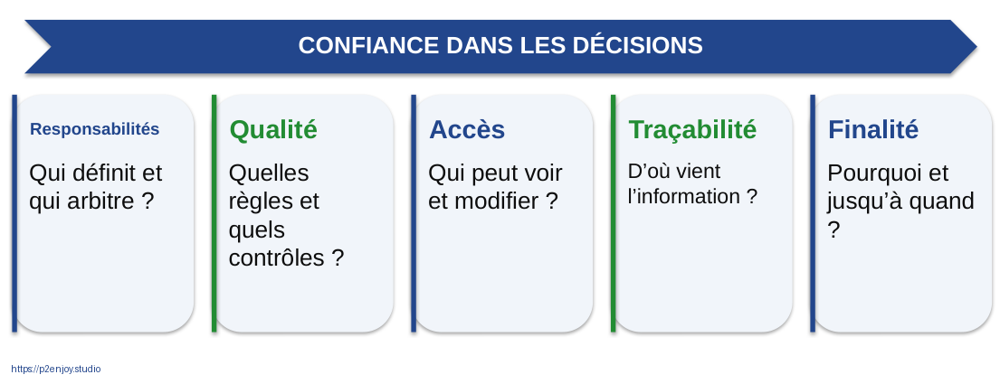

Figure J1-043. Gouverner : répondre à neuf questions. Schéma pédagogique original, version éditable dans le PowerPoint.

Question de relance  Une base chiffrée est-elle nécessairement une base bien gouvernée ?

Réponse attendue  Non : qualité, définition, accès légitime, durée et responsabilité restent à établir.

Message à faire retenir  La sécurité est une composante de la gouvernance, pas son synonyme.

Sources : [S15] CNIL : fiches pratiques IA ; [S17] NIST : fonctions du cadre AI RMF 1.0

## J1-044 | Une donnée a plusieurs responsables complémentaires

[Séquence : B3.1] [Modalité : Apport] [Budget de la séquence : 20 min]

Métier. Sponsor : valeur. Responsable de domaine : définition.

Données. Référent qualité : règles. Ingénieur : flux.

Modèle. Data scientist : évaluation. ML engineer : exploitation.

Contrôle. DSI, RSSI, DPO et juridique : expertise et validation selon leurs rôles.

Ces rôles constituent un modèle organisationnel proposé et non une obligation d’embaucher une personne par case. Dans une petite structure, plusieurs fonctions peuvent être portées par la même personne, mais leurs responsabilités restent distinctes. Le DPO conseille sur les données personnelles ; il ne devient pas automatiquement propriétaire de toutes les décisions. Le métier conserve la responsabilité de l’objectif et de l’action.

Question de relance  Qui approuve le seuil de contact de l’équipe commerciale ?

Réponse attendue  Le responsable métier désigné, éclairé par data, opérations et fonctions de contrôle selon les risques.

Message à faire retenir  Une personne peut cumuler des fonctions ; une responsabilité ne doit pas disparaître.

## J1-045 | La qualité se lit dans les conséquences

[Séquence : B3.1] [Modalité : Apport] [Budget de la séquence : 20 min]

Complétude. Des champs nécessaires sont absents.

Validité. Une valeur sort du domaine attendu.

Cohérence. Deux sources se contredisent.

Unicité. Un même objet apparaît plusieurs fois.

Fraîcheur. Le signal ne décrit plus la situation.

Pertinence. La donnée ne sert pas la finalité.

Une valeur manquante n’a pas le même effet selon le cas. L’âge peut être inutile pour une opération logistique et important dans un traitement réglementé. Les règles de qualité doivent donc être reliées à l’usage. Les apprenants doivent proposer des tests concrets : bornes, clés uniques, fréquence de mise à jour, valeurs autorisées. La collecte d’une nouvelle variable n’est pas une solution automatique.

Question de relance  Quelle règle de qualité pourrait être exécutée tous les matins ?

Réponse attendue  Par exemple vérifier les identifiants uniques et la part de scores dont les données datent de moins de 24 heures, avec seuil justifié.

Message à faire retenir  Une règle de qualité utile est testable, attribuée et reliée à un impact.

Sources : [S03] scikit-learn : pièges et fuites de données ; [S15] CNIL : fiches pratiques IA

## J1-046 | Définition, provenance, usage : le triptyque documentaire

[Séquence : B3.1] [Modalité : Apport] [Budget de la séquence : 20 min]

Dictionnaire. Que signifie la variable ?

Provenance. D’où vient-elle et quand ?

Transformation. Comment a-t-elle été calculée ?

Consommation. Quels systèmes en dépendent ?

Prendre la variable « client actif ». Elle peut signifier contrat valide, usage récent ou paiement récent. Deux équipes peuvent employer le même nom pour des critères différents. Le dictionnaire doit préciser unité, type, règles et propriétaire. La provenance indique la source ; la traçabilité des transformations explique les calculs ; la liste des consommateurs permet d’évaluer l’impact d’un changement.

Question de relance  Pourquoi changer une définition peut-il casser un modèle sans erreur informatique ?

Réponse attendue  Le schéma reste valide mais le sens statistique de la variable a changé.

Message à faire retenir  Le sens métier fait partie du contrat de données.

Sources : [S28] Sculley et al. : dette technique des systèmes ML

## J1-047 | A06 • Sept anomalies et une variable du futur

[Séquence : B3.2] [Modalité : TP] [Budget de la séquence : 35 min]

Fichier. novalia_audit_qualite.csv

Mission. Trouver les défauts et leurs conséquences.

Réponse. Règle de détection, correction, responsable.

Piège. Une colonne prédit parfaitement parce qu’elle arrive trop tard.

Répartir les trente-cinq minutes : cinq de prise en main, quinze d’audit en binômes, dix de correction et cinq de priorisation. Le fichier contient volontairement montants négatifs, ancienneté impossible, catégorie divergente, satisfaction hors domaine, identifiant dupliqué, valeur manquante, donnée ancienne et date de résiliation future. Ne pas modifier le fichier propre utilisé pour le TP ML : cette version sert uniquement à l’audit.

Question de relance  Quelle anomalie arrêterait immédiatement votre entraînement ?

Réponse attendue  La présence d’une information postérieure à la décision ou une cible invalide impose un recadrage avant calcul.

Message à faire retenir  35 minutes • Cahier A06 • Fichier d’audit séparé du fichier ML

## J1-048 | Lire les anomalies avant de les corriger

[Séquence : B3.2] [Modalité : TP] [Budget de la séquence : 35 min]

| Champ | Exemple défectueux | Question |
| --- | --- | --- |
| monthly_spend | -49 | Erreur ou avoir métier ? |
| tenure_months | -3 | Unité ou date de départ ? |
| contract_type | « Mensuel » avec espaces | Même catégorie ? |
| satisfaction_score | 18 / 10 | Barème ou saisie ? |
| last_refresh | 2024-01-01 | Encore pertinent ? |

Insister sur le fait qu’une valeur négative n’est pas universellement fausse : un avoir comptable existe. C’est la définition choisie de monthly_spend dans la simulation, montant contractuel mensuel positif, qui rend ici la valeur invalide. Corriger automatiquement sans comprendre le métier peut détruire une information. Faire distinguer réparation, mise en quarantaine et retour à la source.

Question de relance  Faut-il remplacer toute valeur aberrante par la moyenne ?

Réponse attendue  Non. Il faut comprendre sa cause et son statut, puis choisir une correction documentée.

Message à faire retenir  La règle dépend du dictionnaire, pas seulement de l’apparence du nombre.

## J1-049 | La fuite de données peut se cacher dans un agrégat

[Séquence : B3.2] [Modalité : TP] [Budget de la séquence : 35 min]

Historique autorisé. Tickets avant t₀

Calcul du score. t₀

Historique interdit. Tickets après t₀

Cible. Départ dans 30 jours

Une pipeline peut éviter d’ajuster un scaler sur le test, mais ne peut pas reconnaître qu’un agrégat contient le futur. Demander comment a été calculé « tickets sur 90 jours » : relativement à quelle date ? Le même problème apparaît si l’on entraîne et teste sur plusieurs lignes du même client sans séparation par groupe. La fuite est un défaut de protocole, pas une performance exceptionnelle.

Question de relance  Un score parfait doit-il rassurer ?

Réponse attendue  Il faut d’abord chercher une fuite, un doublon, une cible triviale ou un test non indépendant.

Message à faire retenir  La temporalité se vérifie avant le nom de l’algorithme.

Sources : [S03] scikit-learn : pièges et fuites de données ; [S29] scikit-learn : validation croisée

## J1-050 | Corrigé : détecter, décider, attribuer

[Séquence : B3.2] [Modalité : TP] [Budget de la séquence : 35 min]

| Anomalie | Traitement proposé | Responsable |
| --- | --- | --- |
| Doublon d’identifiant | Réconcilier avec la source | Domaine client |
| Catégorie divergente | Normaliser avec table de correspondance | Référent qualité |
| Valeur manquante | Mesurer puis imputer si justifié | Données + métier |
| Donnée périmée | Actualiser ou exclure | Propriétaire du flux |
| Variable future | Exclure du protocole défini | Data scientist + métier |

Le corrigé propose des réponses, pas une seule politique universelle. Les apprenants doivent documenter pourquoi ils suppriment ou modifient une valeur. L’imputation n’est pas une reconstitution certaine de la réalité. Une correction doit rester traçable et ne pas effacer silencieusement le défaut de la source. La suppression d’une variable future doit être accompagnée d’un test pour éviter sa réintroduction.

Question de relance  Quel livrable protège le prochain utilisateur du dataset ?

Réponse attendue  Le dictionnaire, le journal de qualité et les règles exécutables associés au jeu versionné.

Message à faire retenir  Une correction sans trace prépare une nouvelle erreur.

## J1-051 | Données personnelles : les réflexes CNIL

[Séquence : B3.3] [Modalité : Apport] [Budget de la séquence : 15 min]

Finalité. Quel usage précis et quel acteur responsable ?

Licéité. Quelle base et quels droits de réutilisation ?

Minimisation. Quelles variables réellement nécessaires ?

Protection. Accès, durée, sécurité, droits et AIPD si nécessaire.

Les recommandations CNIL expliquent l’application du RGPD au développement d’IA utilisant des données personnelles. Il faut identifier les acteurs et la finalité avant de choisir une base légale. Le consentement n’est ni l’unique base possible ni une formule qui autorise tout. L’AIPD dépend des risques et critères applicables. Cette diapositive sert à repérer les questions à instruire avec les fonctions compétentes, pas à rendre un avis juridique pour une entreprise.

Question de relance  Des données accessibles en ligne sont-elles librement réutilisables pour tout entraînement ?

Réponse attendue  Non. Accessibilité, droits, finalité et garanties sont des questions distinctes.

Message à faire retenir  La disponibilité technique d’une donnée ne suffit pas à établir son droit d’usage.

Sources : [S15] CNIL : fiches pratiques IA ; [S32] CNIL : recommandations relatives à l’intérêt légitime

## J1-052 | Minimiser sans rendre le modèle aveugle

[Séquence : B3.3] [Modalité : Apport] [Budget de la séquence : 15 min]

Disponibles. Toutes les variables collectées

Pertinentes. Celles liées au besoin

Nécessaires. Celles dont l’utilité est justifiée

Autorisées. Celles utilisables dans ce cadre

Le schéma n’est pas un quota numérique universel. La nécessité s’apprécie selon la finalité, les risques et les alternatives. Une variable proxy peut révéler indirectement une information sensible ; supprimer le nom de cette information ne suffit pas. La pseudonymisation réduit certains risques mais n’équivaut pas automatiquement à une anonymisation. Les données Novalia sont synthétiques, ce qui simplifie la distribution pédagogique sans prouver que toute donnée synthétique est sans risque.

Question de relance  Supprimer les noms suffit-il à anonymiser un fichier ?

Réponse attendue  Non. Des combinaisons de caractéristiques peuvent encore identifier une personne.

Message à faire retenir  Justifier une variable, sa précision, sa durée et son accès.

Sources : [S15] CNIL : fiches pratiques IA

## J1-053 | Règlement IA : un calendrier progressif

[Séquence : B3.3] [Modalité : Apport] [Budget de la séquence : 15 min]

02 fév. 2025. Interdictions et maîtrise IA

02 août 2025. Modèles d’usage général

02 août 2026. Transparence et règles applicables

02 déc. 2027. Haut risque, annexe III

02 août 2028. Produits réglementés, annexe I

Le calendrier affiché suit la page officielle de la Commission consultée le 14 septembre 2026 et intègre les modifications entrées en vigueur le 27 juillet 2026. Il ne signifie pas que toutes les obligations ont la même date ni que les textes sectoriels cessent de s’appliquer. Les cas de transition et les systèmes déjà sur le marché doivent être vérifiés. Le dossier initial restait trop général sur les exceptions ; cette version les rend visibles.

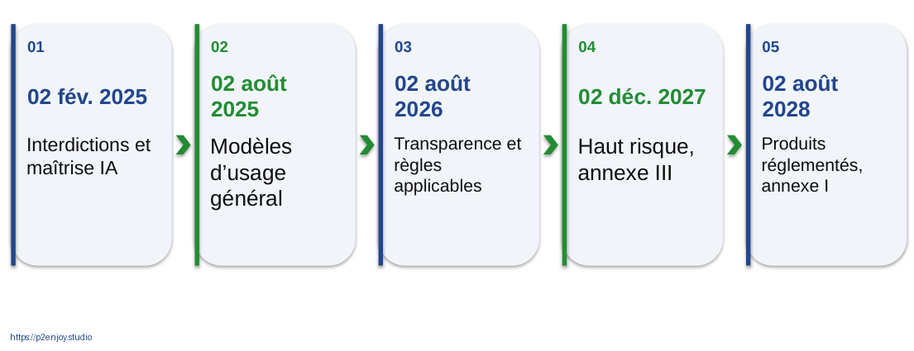

Figure J1-053. Règlement IA : un calendrier progressif. Schéma pédagogique original, version éditable dans le PowerPoint.

Question de relance  Peut-on conclure qu’aucune règle ne s’applique avant 2027 à un usage de recrutement ?

Réponse attendue  Non. RGPD, règles déjà applicables et autres textes restent pertinents ; il faut qualifier l’usage et le rôle.

Message à faire retenir  Veille au 14 septembre 2026 • Vérifier le cas concret avant chaque session.

Sources : [S20] Commission européenne : calendrier d’application IA ; [S31] Commission européenne : entrée en vigueur de l’AI Omnibus

## J1-054 | Qualifier l’usage, pas seulement la technologie

[Séquence : B3.3] [Modalité : Apport] [Budget de la séquence : 15 min]

Usage. Que fait le système et pour qui ?

Rôle. Fournisseur, déployeur ou autre acteur ?

Risque. Effets sur les personnes et contexte ?

Le mot chatbot, réseau de neurones ou logiciel RH ne suffit pas à déterminer une catégorie réglementaire. Un outil qui classe une documentation interne et un outil qui sélectionne des candidats n’ont pas le même contexte. La qualification doit porter sur la finalité réelle, le rôle de l’organisation et les effets possibles. Ne pas promettre une conformité à partir d’une formation ou d’un achat d’outil.

Question de relance  Un modèle ouvert dispense-t-il de toutes les obligations du système déployé ?

Réponse attendue  Non. Le contexte d’usage et le rôle du déployeur restent à analyser.

Message à faire retenir  Même technologie, usages différents, obligations potentiellement différentes.

Sources : [S19] Commission européenne : cadre réglementaire IA

## J1-055 | Former selon le rôle et le risque

[Séquence : B3.3] [Modalité : Apport] [Budget de la séquence : 15 min]

Experts. Concevoir, sécuriser et valider

Équipes IT/data. Intégrer, évaluer et surveiller

Métiers / managers. Cadrer, interpréter et superviser

Utilisateurs. Comprendre, vérifier et signaler

Cette pyramide est pédagogique, non une classification juridique. La FAQ officielle sur la maîtrise de l’IA insiste sur le contexte, les connaissances et les responsabilités. Elle n’impose pas un certificat unique ni de garantir un niveau identique pour chaque individu. Documenter les actions de formation et leur adaptation aux systèmes effectivement utilisés. Éviter de présenter le certificat de réalisation de cette formation comme une certification générale de conformité.

Question de relance  Quel apprentissage spécifique pour une personne autorisée à valider une alerte ?

Réponse attendue  Comprendre les limites du score, les critères de revue, les possibilités de refus et le circuit d’escalade.

Message à faire retenir  La maîtrise de l’IA doit être utile aux tâches réellement exercées.

Sources : [S21] Commission européenne : maîtrise de l’IA

## J1-056 | Sécuriser toute la chaîne, pas seulement le modèle

[Séquence : B3.3] [Modalité : Apport] [Budget de la séquence : 15 min]

Données. Altération ou accès excessif

Modèle. Version ou dépendance compromise

Interfaces. Entrée malveillante ou fuite

Actions. Privilèges trop larges

Suivi. Absence de trace ou d’alerte

Les recommandations ANSSI sur l’IA générative couvrent plusieurs phases du cycle de vie. Le schéma transpose une lecture défensive à un SI d’entreprise : isoler les secrets, limiter les privilèges, vérifier les entrées, contrôler les sorties et journaliser proportionnellement. Pour un assistant relié à des outils, le droit d’agir doit être contrôlé côté application, pas seulement décrit dans une consigne textuelle. Aucun exercice offensif n’est demandé.

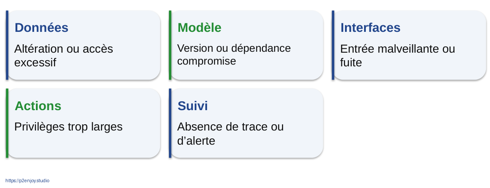

Figure J1-056. Sécuriser toute la chaîne, pas seulement le modèle. Schéma pédagogique original, version éditable dans le PowerPoint.

Question de relance  Pourquoi une consigne « ne divulgue pas de secret » ne remplace-t-elle pas le contrôle d’accès ?

Réponse attendue  Parce que la protection doit être appliquée par des mécanismes indépendants de la réponse du modèle.

Message à faire retenir  Limiter ce que le système peut lire, appeler et déclencher.

Sources : [S16] ANSSI : sécurité d’un système d’IA générative

## J1-057 | A07 • Qui répond de la donnée, du modèle et de l’action ?

[Séquence : B3.4] [Modalité : TP] [Budget de la séquence : 45 min]

Scénario. Score nocturne de départ, puis file commerciale.

Livrable. RACI + règles de qualité + registre de risques.

À décider. Seuil, accès, conservation et mode dégradé.

À instruire. Questions juridiques non résolues, sans inventer une réponse.

Répartir quarante-cinq minutes : cinq de lecture, quinze d’attribution, quinze de risques, dix de revue. Une matrice RACI doit conserver un seul responsable d’arbitrage A par décision, tandis que plusieurs réalisateurs R peuvent coopérer. Distinguer celui qui conseille de celui qui approuve. Le groupe doit définir un circuit d’incident, même si le risque est peu probable.

Question de relance  Qui assume l’arrêt du système si les alertes deviennent incohérentes ?

Réponse attendue  Le propriétaire du service ou le responsable explicitement désigné, selon un seuil et une procédure convenus.

Message à faire retenir  45 minutes • Cahier A07 • Un A explicite pour chaque décision

## J1-058 | RACI : éviter les responsabilités collectives floues

[Séquence : B3.4] [Modalité : TP] [Budget de la séquence : 45 min]

| Décision | Métier | Data | IT | DPO / RSSI |
| --- | --- | --- | --- | --- |
| Finalité | A/R | C | C | C |
| Qualité métier | A | R | R | C |
| Validation modèle | A | R | C | C |
| Exploitation | C | C | A/R | C |
| Traitement incident | A | R | R | C |

Cette matrice est un exemple simplifié. A signifie arbitrage et responsabilité de la décision ; R réalisation ; C consultation ; I information. Une organisation peut choisir d’autres propriétaires selon ses structures. L’incident nécessite un responsable désigné, pas une réponse automatique du DPO. Le groupe ajoute la dimension I dans sa fiche et explicite les cas où un organe de contrôle doit valider plutôt qu’être simplement consulté.

Question de relance  Une matrice suffit-elle si personne ne dispose du temps ni des droits nécessaires ?

Réponse attendue  Non. La responsabilité doit être accompagnée de moyens, de droits et d’une procédure réellement utilisable.

Message à faire retenir  Exemple pédagogique à adapter, non structure imposée.

## J1-059 | Gérer les risques avec quatre verbes

[Séquence : B3.4] [Modalité : TP] [Budget de la séquence : 45 min]

Gouverner. Attribuer et fixer les règles

Cartographier. Comprendre contexte et dommages

Mesurer. Tester les performances et risques

Traiter. Réduire, accepter, surveiller ou arrêter

Le NIST AI RMF 1.0 est un cadre volontaire. Sa fonction de gouvernance traverse les trois autres ; ce n’est pas une simple étape à terminer au début. Le schéma français est une adaptation pédagogique. Le cadre ne remplace pas les obligations applicables. ISO/IEC 42001 apporte une perspective de système de management ; il ne faut pas confondre certification d’un management et garantie d’absence d’erreur d’un modèle.

Question de relance  Quel risque faut-il accepter explicitement plutôt que laisser implicite ?

Réponse attendue  Le risque résiduel après les mesures de réduction, avec un propriétaire et des limites d’usage.

Message à faire retenir  Un risque traité reste surveillé pendant l’exploitation.

Sources : [S17] NIST : fonctions du cadre AI RMF 1.0 ; [S18] ISO/IEC 42001 : système de management de l’IA

## J1-060 | Le registre de risques doit déclencher une action

[Séquence : B3.4] [Modalité : TP] [Budget de la séquence : 45 min]

| Risque | Signal | Réponse |
| --- | --- | --- |
| Donnée périmée | Âge supérieur au seuil | Suspendre ou repli |
| Score instable | Distribution inhabituelle | Analyse et revue |
| Accès excessif | Droits non justifiés | Révoquer et limiter |
| Faux positifs | File trop chargée | Réviser la politique |
| Usage non prévu | Nouveau processus | Nouvelle validation |

Chaque ligne doit inclure un responsable, une probabilité ou appréciation motivée, un impact et une échéance de revue dans le cahier. Les seuils du support sont qualitatifs ; le groupe propose ensuite des valeurs cohérentes avec le cas. Une mesure de contrôle sans mécanisme de détection reste difficile à appliquer. La suspension doit être associée à un mode métier alternatif.

Question de relance  Que manque-t-il à « surveiller le modèle » ?

Réponse attendue  Une métrique, une fréquence, un seuil, une personne alertée et une action attendue.

Message à faire retenir  Un risque sans propriétaire est une alerte sans destinataire.

## J1-061 | Vérifier les acquis avant le jour 2

[Séquence : B3.5] [Modalité : Évaluation] [Budget de la séquence : 5 min]

01. Citez une donnée qui arriverait trop tard.

02. Distinguez score et décision.

03. Donnez un coût de faux positif.

04. Nommez un responsable d’action.

05. Expliquez une condition d’ouverture des données.

Cinq minutes de récupération active individuelle. Demander une réponse en une phrase par question, puis faire corriger deux réponses au tableau. Les réponses détaillées figurent dans le guide. Noter les notions qui restent fragiles pour ajuster le rappel du lendemain. Ne pas ajouter une conclusion générale qui absorberait du temps d’atelier.

Question de relance  Quel point reste à clarifier pour vous ?

Réponse attendue  Exemples attendus : variable postérieure ; score estimé contre politique ; client bloqué ; propriétaire métier ; droit d’usage ou contrôle d’accès.

Message à faire retenir  Conservez votre canevas et votre registre : ils servent demain.

# Machine Learning, Deep Learning et intégration SI

[Bloc : B4] [Niveau : Application] [Fiches synchronisées avec les identifiants des diapositives]

## J2-002 | Rappel actif : reconstruire le système

[Séquence : B4.1] [Modalité : Évaluation] [Budget de la séquence : 10 min]

Donnée. Qu’est-ce qui doit exister avant le score ?

Modèle. Quelle différence entre entraînement et inférence ?

Décision. Qui approuve le seuil ?

Mesure. Quel indicateur prouve une valeur métier ?

Utiliser dix minutes : trois de rappel individuel, quatre en binôme et trois de correction. Demander un exemple nouveau pour éviter une récitation. Vérifier simultanément que les fichiers locaux sont accessibles, sans faire de l’installation improvisée une activité centrale. Si un poste échoue, basculer sur le corrigé exécuté et les exports, ou travailler à deux.

Question de relance  Quelle partie du système est absente d’un fichier contenant uniquement des probabilités ?

Réponse attendue  L’action, la responsabilité, la mesure d’impact et les contrôles d’exploitation.

Message à faire retenir  Le vocabulaire de la veille devient un protocole de travail.

## J2-004 | Six décisions avant de choisir un algorithme

[Séquence : B4.2] [Modalité : Apport] [Budget de la séquence : 20 min]

Unité. Un client actif

Cible. Départ oui / non

Horizon. Dans 30 jours

Entrées. Disponibles à t₀

Action. Contact possible

Mesure. Erreurs et valeur

Cadrer le churn en français comme un risque de départ ou de résiliation. Unité et horizon doivent être écrits. Les données doivent correspondre à l’état du client au moment de la décision. L’horizon d’apprentissage doit laisser le temps d’agir. Un projet peut échouer parce que les étiquettes ne sont connues que tardivement ou parce que la définition du départ change selon les contrats.

Question de relance  « Prédire les clients insatisfaits » est-il suffisamment précis ?

Réponse attendue  Non : il faut un événement observable, une unité, une échéance et une source d’étiquettes.

Message à faire retenir  Un problème bien formulé rend les choix de modèle discutables et testables.

## J2-005 | Régression et classification : deux sorties différentes

[Séquence : B4.2] [Modalité : Apport] [Budget de la séquence : 20 min]

Régression. Estimer une quantité.
Exemple : 240 commandes demain.
Erreur : écart au réel.

Classification. Estimer une classe ou un score.
Exemple : risque de départ.
Erreur : faux positif / faux négatif.

Le mot régression peut prêter à confusion : la régression logistique est généralement utilisée pour classifier. Présenter les familles par leur sortie et leur critère de validation. Pour une prévision de quantité, une erreur de dix unités peut être tolérable ou critique selon le stock et l’incertitude. Pour la classification, la valeur dépend du seuil et de l’action.

Question de relance  Quelle métrique pourrait servir à une prévision de ventes ?

Réponse attendue  Une erreur absolue moyenne et des mesures adaptées à l’horizon et au coût de rupture, plutôt qu’une exactitude de classes.

Message à faire retenir  Le nom d’un algorithme ne suffit pas à expliquer ce qu’il produit.

Sources : [S02] scikit-learn : guide utilisateur ; [S04] scikit-learn : métriques et scores

## J2-006 | Une référence simple évite la sophistication gratuite

[Séquence : B4.2] [Modalité : Apport] [Budget de la séquence : 20 min]

Règle actuelle. La méthode utilisée aujourd’hui.

Modèle trivial. Classe majoritaire ou prévision naïve.

Modèle simple. Une régression ou un petit arbre.

Modèle plus riche. À retenir seulement s’il apporte une valeur utile.

La baseline doit être explicitée avant l’expérimentation. En prévision temporelle, reprendre la dernière valeur ou la même période précédente peut être une référence solide. En classification déséquilibrée, la classe majoritaire peut sembler bonne en exactitude tout en ayant un rappel nul. Le TP montrera ce cas. La comparaison porte aussi sur la maintenabilité, la latence et les coûts.

Question de relance  Quel résultat invaliderait la complexité ajoutée ?

Réponse attendue  Un bénéfice inexistant ou trop faible par rapport au coût et aux risques de la solution plus simple.

Message à faire retenir  Toujours comparer à une solution crédible sans sophistication supplémentaire.

Sources : [S04] scikit-learn : métriques et scores

## J2-007 | Régression logistique : un score pour classer

[Séquence : B4.2] [Modalité : Apport] [Budget de la séquence : 20 min]

Entrées. Caractéristiques du client

Combinaison. Paramètres appris

Score. Estimation entre 0 et 1

Seuil. Politique d’action séparée

La régression logistique apprend une combinaison des variables et la transforme en score borné. L’interprétation d’un coefficient dépend des autres variables, du codage et de l’échelle ; elle ne prouve pas un effet causal. Un score produit par predict_proba n’est pas automatiquement bien calibré sur une future population réelle. La simplicité relative facilite la discussion sans supprimer la nécessité de validation.

Question de relance  0,78 signifie-t-il que le départ d’une personne précise est certain ?

Réponse attendue  Non. Il s’agit d’une estimation issue du modèle, à évaluer et à calibrer selon l’usage.

Message à faire retenir  Le seuil de 0,5 est une convention, pas une décision métier obligatoire.

Sources : [S02] scikit-learn : guide utilisateur ; [S30] scikit-learn : choix du seuil de décision

## J2-008 | Arbre de décision : une succession de séparations

[Séquence : B4.2] [Modalité : Apport] [Budget de la séquence : 20 min]

Premier test. Satisfaction faible ?

Deuxième test. Tickets nombreux ?

Feuille. Risque estimé dans ce sous-groupe

Le dessin est un arbre fictif pour expliquer le principe, pas l’arbre entraîné du TP. Les coupures sont choisies pour séparer les données selon un critère. Un arbre peut être lisible lorsqu’il reste petit et devenir difficile à interpréter lorsqu’il est profond. Les seuils peuvent changer fortement avec de petites variations des données, d’où l’intérêt de méthodes d’ensemble.

Question de relance  Un arbre facile à dessiner est-il nécessairement le plus fiable ?

Réponse attendue  Non. Lisibilité et performance doivent être évaluées séparément.

Message à faire retenir  Un arbre apprend des règles à partir d’exemples ; ses seuils ne sont pas des lois.

Sources : [S02] scikit-learn : guide utilisateur

## J2-009 | Forêt et boosting : deux façons de combiner

[Séquence : B4.2] [Modalité : Apport] [Budget de la séquence : 20 min]

Forêt aléatoire. Plusieurs arbres variés contribuent à la prédiction.
L’agrégation réduit certaines instabilités.

Boosting. Des modèles successifs améliorent progressivement un critère d’erreur.
Les réglages et la validation restent essentiels.

Éviter l’image trompeuse d’un vote d’experts humains. Il s’agit de modèles entraînés selon des procédures différentes. La forêt du TP est volontairement limitée pour exécuter rapidement le cours. Elle n’est pas une recherche exhaustive du meilleur modèle. Le boosting est présenté comme une famille utile, sans prétendre qu’elle gagne dans tous les cas.

Question de relance  Pourquoi un modèle plus complexe peut-il perdre contre la logistique dans le TP ?

Réponse attendue  Parce que la structure des données, les réglages et le protocole peuvent favoriser une méthode plus simple.

Message à faire retenir  La comparaison empirique remplace le classement de prestige des algorithmes.

Sources : [S02] scikit-learn : guide utilisateur

## J2-010 | Regrouper, détecter, recommander : sans tout confondre

[Séquence : B4.2] [Modalité : Apport] [Budget de la séquence : 20 min]

Regroupement. Chercher des observations proches, puis interpréter les groupes.

Anomalie. Repérer l’inhabituel, sans l’assimiler automatiquement à un défaut.

Recommandation. Trier des possibilités pour un utilisateur et un contexte.

Le regroupement non supervisé ne fournit pas spontanément un sens métier aux groupes. La proximité dépend de l’échelle, des variables et de la distance. Une anomalie peut être une nouveauté légitime. La recommandation peut intégrer des règles, des représentations et plusieurs modèles. Utiliser les cas de la veille pour éviter que les familles restent abstraites.

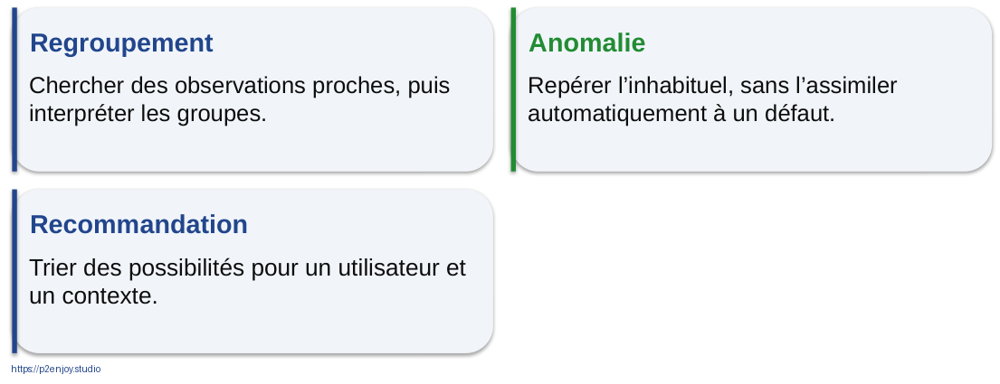

Figure J2-010. Regrouper, détecter, recommander : sans tout confondre. Schéma pédagogique original, version éditable dans le PowerPoint.

Question de relance  Un groupe mathématique peut-il devenir un segment commercial sans revue ?

Réponse attendue  Il doit être interprété, testé et évalué pour son utilité et ses conséquences.

Message à faire retenir  La sortie mathématique doit être interprétée avant de devenir une catégorie métier.

Sources : [S02] scikit-learn : guide utilisateur

## J2-011 | A08a • Ouvrir le laboratoire Novalia

[Séquence : B4.3] [Modalité : TP] [Budget de la séquence : 40 min]

Fichier. 01_Atelier_Novalia_participant.ipynb

Données. 5 000 clients fictifs, aucune donnée personnelle réelle.

Mission. Explorer, séparer et entraîner trois modèles.

Livrable. Réponses aux analyses 1 et 2 du notebook.

Le TP est guidé et ne demande pas de saisir toute la syntaxe. Exécuter les cellules dans l’ordre, lire les sorties et répondre aux questions. En variante sans code, le corrigé exécuté est affiché sans ses réponses d’analyse et les CSV de résultats sont distribués. Réserver l’effort à la compréhension des blocs. Le temps prévu est quarante minutes et n’inclut pas une installation improvisée de Python.

Question de relance  Quelle sortie attendez-vous avant tout entraînement ?

Réponse attendue  Dimensions du jeu, proportion de départs, types, valeurs manquantes et identité de la cible.

Message à faire retenir  40 minutes • Notebook participant • Cahier A08

## J2-012 | Un notebook relie texte, calcul et résultat

[Séquence : B4.3] [Modalité : TP] [Budget de la séquence : 40 min]

Cellule texte. L’hypothèse et l’explication

Cellule code. Le calcul reproductible

Sortie. Le résultat à interpréter

Analyse. Votre décision et sa justification

Jupyter est un environnement interactif. L’état en mémoire peut rendre une exécution désordonnée trompeuse : une variable ancienne peut persister après modification. La bonne vérification consiste à redémarrer le noyau et exécuter toutes les cellules dans l’ordre. Le notebook corrigé fourni a été exécuté de bout en bout. Ne pas présenter un notebook comme une application industrielle terminée.

Question de relance  Pourquoi une cellule peut-elle réussir chez l’auteur et échouer après redémarrage ?

Réponse attendue  Elle dépendait d’un état antérieur non décrit dans l’ordre visible des cellules.

Message à faire retenir  Avant livraison : redémarrer le noyau et tout réexécuter.

Sources : [S25] Projet Jupyter : documentation

## J2-013 | Le jeu de données : ce que signifie une ligne

[Séquence : B4.3] [Modalité : TP] [Budget de la séquence : 40 min]

| Champ | Sens | Usage |
| --- | --- | --- |
| customer_id | Identifiant fictif unique | Traçabilité, pas prédicteur |
| tenure_months | Ancienneté en mois | Entrée numérique |
| support_tickets_90d | Tickets avant la référence | Entrée numérique |
| contract_type | Type de contrat | Entrée catégorielle |
| churn | Départ dans les 30 jours | Cible binaire |

Chaque ligne représente un client indépendant de la simulation. Le dictionnaire complet est remis en annexe. Les noms techniques du CSV sont conservés pour permettre le suivi du code mais tous sont expliqués en français. Le montant mensuel n’est pas une mesure de marge. Le taux de départ résulte de la loi de génération construite et ne représente aucun secteur économique.

Question de relance  Pourquoi conserver l’identifiant si on ne l’utilise pas comme entrée ?

Réponse attendue  Pour relier le résultat au dossier, vérifier l’unicité et suivre les exports sans apprendre un numéro arbitraire.

Message à faire retenir  Une ligne, une unité, une date de référence et une cible.

Sources : [P01] Calculs reproductibles du TP Novalia

## J2-014 | Avant d’entraîner : inspecter le déséquilibre

[Séquence : B4.3] [Modalité : TP] [Budget de la séquence : 40 min]

17,48 %  de départs dans le jeu synthétique complet

Le taux affiché est calculé sur le fichier distribué. Il ne faut pas le présenter comme un taux du marché. Les valeurs manquantes sont introduites pour montrer l’imputation. On ne remplace pas automatiquement une absence par zéro : zéro peut être une valeur métier valide. Demander ce que ferait la classe majoritaire, puis comparer avec les sorties du notebook.

Question de relance  Quel serait le rappel d’une règle qui prédit « reste » pour tous ?

Réponse attendue  Zéro, même avec une exactitude supérieure à 80 % dans cette simulation.

Message à faire retenir  Les statistiques affichées sont calculées sur le fichier joint, pas inventées.

Sources : [P01] Calculs reproductibles du TP Novalia

## J2-015 | Trois jeux, trois fonctions

[Séquence : B4.3] [Modalité : TP] [Budget de la séquence : 40 min]

60 %. Entraînement
3 000 clients

20 %. Validation
1 000 clients

20 %. Test
1 000 clients

La séparation aléatoire stratifiée est adaptée à la démonstration de clients indépendants. Pour un historique réel, il faut souvent séparer dans le temps ou par client, machine ou établissement. L’entraînement ajuste les transformations et les modèles ; la validation choisit modèle et seuil ; le test estime la performance finale une fois les choix gelés. Le test ne devient pas une nouvelle validation après une déception.

Question de relance  Pourquoi les 20 % de test restent-ils fermés ?

Réponse attendue  Pour limiter l’optimisme lié aux choix successifs faits sur les résultats observés.

Message à faire retenir  Choisir sur validation ; évaluer une fois sur test.

Sources : [S03] scikit-learn : pièges et fuites de données ; [S29] scikit-learn : validation croisée

## J2-016 | Prétraitement : apprendre sur le train seulement

[Séquence : B4.3] [Modalité : TP] [Budget de la séquence : 40 min]

Manquants. Médiane ou modalité fréquente

Catégories. Encodage stable

Échelles. Normalisation si utile

Modèle. Apprentissage supervisé

Les statistiques d’imputation et de normalisation sont apprises sur l’entraînement. On transforme ensuite validation et test avec ces mêmes objets. Ajuster une moyenne sur l’ensemble des données introduirait déjà de l’information provenant du test. L’encodage doit prévoir une catégorie inconnue en production. La pipeline ne dispense pas d’un contrôle métier des entrées.

Question de relance  Pourquoi ne pas recalculer la moyenne de normalisation pour chaque requête ?

Réponse attendue  Le modèle a appris avec une transformation donnée ; changer cette transformation altère le sens de ses entrées.

Message à faire retenir  Même chaîne en expérimentation et en usage réel, avec paramètres appris correctement.

Sources : [S03] scikit-learn : pièges et fuites de données

## J2-017 | Lire le code par blocs fonctionnels

[Séquence : B4.3] [Modalité : TP] [Budget de la séquence : 40 min]

Préparer. Remplacer, coder, normaliser.

Apprendre. Ajuster les paramètres du classifieur.

Le code projeté est un extrait explicatif ; le notebook contient les imports, les listes de colonnes et la construction complète du ColumnTransformer. Ne pas demander d’exécuter ce fragment isolé. Les participants identifient la séparation préparation/modèle et retrouvent les mêmes noms dans le notebook. Une erreur de variable doit conduire à relire le contexte plutôt qu’à copier un autre fragment au hasard.

Question de relance  Quelle partie change lorsqu’on compare logistique et forêt ?

Réponse attendue  Le classifieur, tandis que le protocole et la chaîne de préparation restent contrôlés.

Message à faire retenir  Extrait de lecture ; le notebook joint contient le programme complet.

Sources : [S02] scikit-learn : guide utilisateur ; [S03] scikit-learn : pièges et fuites de données

## J2-018 | Trois modèles, une comparaison équitable

[Séquence : B4.3] [Modalité : TP] [Budget de la séquence : 40 min]

Majoritaire. Une référence qui prédit la classe dominante.

Logistique. Une relation paramétrée relativement simple.

Forêt. Un ensemble d’arbres aux réglages limités.

Tous les modèles reçoivent les mêmes séparations et sont évalués sur les mêmes exemples. La comparaison n’est pas une compétition universelle entre algorithmes : elle porte sur ce jeu construit et ces réglages. Ne pas ajuster plusieurs fois les paramètres après consultation du test. La graine fixée facilite la reproduction mais ne démontre pas que le résultat est stable sur toutes les populations.

Figure J2-018. Trois modèles, une comparaison équitable. Schéma pédagogique original, version éditable dans le PowerPoint.

Question de relance  Pourquoi ne pas ajouter dix modèles immédiatement ?

Réponse attendue  Pour garder un protocole compréhensible et éviter une sélection opportuniste sans besoin métier.

Message à faire retenir  Le protocole de comparaison compte autant que le modèle choisi.

Sources : [P01] Calculs reproductibles du TP Novalia

## J2-020 | Précision et rappel : deux dénominateurs

[Séquence : B4.4] [Modalité : Apport] [Budget de la séquence : 20 min]

Précision. Vrais positifs / toutes les alertes.
« Parmi les alertes, combien sont pertinentes ? »

Rappel. Vrais positifs / tous les départs réels.
« Parmi les départs, combien sont repérés ? »

Écrire les dénominateurs avant les chiffres. Un rappel élevé peut coûter beaucoup de fausses alertes ; une précision élevée peut laisser passer de nombreux cas. Le F1 combine les deux mais n’intègre pas automatiquement les coûts économiques. Le choix dépend de la capacité, de la criticité et de l’action. Un indicateur moyen peut masquer une classe ou un segment mal traité.

Question de relance  Que mesure la précision d’un modèle de départ ?

Réponse attendue  La proportion de futurs départs parmi les clients signalés au seuil choisi.

Message à faire retenir  Le bon indicateur dépend de la question posée à la file de travail.

Sources : [S04] scikit-learn : métriques et scores

## J2-021 | Comparer un classement et une décision au seuil

[Séquence : B4.4] [Modalité : Apport] [Budget de la séquence : 20 min]

Score continu. Il permet d’ordonner les observations.

Average Precision. Elle résume la courbe précision-rappel.

Seuil choisi. Il transforme le score en alerte.

Coût métier. Il juge les conséquences des alertes et des cas manqués.

L’Average Precision n’est pas l’exactitude, ni le taux de réussite d’une campagne. Elle permet une comparaison de classement dans ce protocole. Une bonne AP n’assure pas une calibration correcte. Le modèle peut classer convenablement les clients tout en surestimant certaines probabilités. Pour un usage financier ou critique, l’évaluation doit être approfondie selon le contexte.

Figure J2-021. Comparer un classement et une décision au seuil. Schéma pédagogique original, version éditable dans le PowerPoint.

Question de relance  0,48 d’AP signifie-t-il que 48 % de toutes les prédictions sont correctes ?

Réponse attendue  Non. C’est une synthèse de la relation précision-rappel, avec une définition différente de l’exactitude.

Message à faire retenir  Ne pas traduire une métrique technique dans une unité qu’elle ne mesure pas.

Sources : [S04] scikit-learn : métriques et scores

## J2-022 | Résultat de validation : la simplicité gagne ici

[Séquence : B4.4] [Modalité : Apport] [Budget de la séquence : 20 min]

| Modèle | AP | Rappel à 0,5 | Alertes |
| --- | --- | --- | --- |
| Référence majoritaire | 0,175 | 0,0 % | 0 |
| Régression logistique | 0,486 | 18,9 % | 59 |
| Forêt aléatoire | 0,460 | 4,6 % | 14 |

Les nombres proviennent de l’exécution du notebook joint sur mille clients de validation. La logistique est sélectionnée selon l’AP prévue dans le protocole. La forêt n’a pas reçu une recherche d’hyperparamètres exhaustive. La conclusion correcte est locale : dans cette simulation et ces réglages, la logistique offre le meilleur classement selon le critère retenu. Le rappel au seuil de 0,5 montre pourquoi ce seuil doit être discuté.

Question de relance  Peut-on en déduire que les forêts sont inférieures en général ?

Réponse attendue  Non. Le résultat dépend des données, des réglages et de la validation.

Message à faire retenir  Résultats de validation • Simulation synthétique • Seuil comparatif : 0,5

Sources : [P01] Calculs reproductibles du TP Novalia

## J2-023 | Le seuil pilote la charge de travail

[Séquence : B4.4] [Modalité : Apport] [Budget de la séquence : 20 min]

Seuil bas. Plus d’alertes, davantage de cas couverts.

Seuil haut. Moins d’alertes, davantage de cas manqués.

Contrainte. L’équipe peut traiter 10 % de la population.

Une augmentation du seuil réduit ou conserve le nombre d’alertes et le rappel sur une population fixée. La précision ne monte pas nécessairement de manière monotone sur un petit échantillon : éviter cette affirmation trop forte. Le TP choisit un seuil sur la validation pour respecter environ cent contacts. Une sélection des k premiers scores est une politique différente qui garantit un quota mais pas un niveau absolu de risque.

Question de relance  Qui a fixé les 10 % ?

Réponse attendue  C’est une hypothèse pédagogique de capacité, pas un résultat du modèle ni une exigence contractuelle.

Message à faire retenir  Séparer le score, le seuil et la capacité réelle des équipes.

Sources : [S30] scikit-learn : choix du seuil de décision

## J2-024 | Une bonne validation respecte la structure du réel

[Séquence : B4.4] [Modalité : Apport] [Budget de la séquence : 20 min]

Clients indépendants. Séparation aléatoire possible dans la simulation.

Historique temporel. Entraîner sur le passé, évaluer sur le futur.

Lignes liées. Séparer par client, machine ou groupe.

Choix multiples. Conserver une évaluation indépendante finale.

Une séparation aléatoire peut mélanger le passé et le futur ou placer des lignes du même client dans les deux jeux. Les estimations deviennent trop optimistes. La validation croisée doit être adaptée aux dépendances et peut elle-même contenir une boucle de sélection. Pour ce public, retenir un principe : reproduire les difficultés du futur usage dans le protocole d’évaluation.

Question de relance  Pourquoi répartir au hasard les fenêtres d’une même machine peut-il tromper ?

Réponse attendue  Le modèle peut retrouver des caractéristiques propres à cette machine déjà vues à l’entraînement.

Message à faire retenir  Le découpage des données est une hypothèse sur le futur usage.

Sources : [S29] scikit-learn : validation croisée

## J2-025 | A08b • Choisir le seuil puis ouvrir le test

[Séquence : B4.5] [Modalité : TP] [Budget de la séquence : 35 min]

Sur validation. Comparer les seuils et fixer une politique.

Décision. Écrire modèle retenu, seuil et capacité.

Sur test. Évaluer une fois sans réajuster les choix.

Livrable. Matrice, coûts d’erreur et limites du résultat.

Répartir trente-cinq minutes : dix pour explorer les seuils, cinq pour écrire la décision, dix pour tester et dix pour interpréter. Le seuil de référence est calculé au milieu des scores classés autour de la centième position de validation. Le groupe peut défendre une autre politique à condition de ne pas l’optimiser sur le test. Les écarts de charge en test sont un résultat d’apprentissage, pas un bug à cacher.

Question de relance  Que faites-vous si le quota est dépassé sur test ?

Réponse attendue  On constate la limite du seuil fixe, puis on choisit et valide une politique de quota ou une file de débordement sans régler opportunément sur ce test.

Message à faire retenir  35 minutes • Le test reste fermé tant que les choix ne sont pas écrits.

## J2-026 | Le seuil appris ne garantit pas le quota futur

[Séquence : B4.5] [Modalité : TP] [Budget de la séquence : 35 min]

105  alertes sur les 1 000 clients du test

Le seuil est dérivé de la distribution de validation. Une autre population peut produire une proportion différente d’alertes. Ce dépassement de cinq cas rend visible la différence entre seuil de risque et quota de traitement. La réponse doit être opérationnelle : file prioritaire, sélection top-k, capacité de réserve ou revue de la politique. Aucune de ces options ne doit être ajoutée silencieusement après le calcul.

Question de relance  Quelle politique garantit cent dossiers exactement lorsque les scores sont nombreux ?

Réponse attendue  Une sélection des cent premiers avec règle de départage des ex æquo, à documenter et valider.

Message à faire retenir  Une contrainte d’équipe doit être implémentée dans la politique, pas espérée du modèle.

Sources : [P01] Calculs reproductibles du TP Novalia

## J2-027 | Test indépendant : lire les quatre cases

[Séquence : B4.5] [Modalité : TP] [Budget de la séquence : 35 min]

|  | Départ réel | Reste réellement |
| --- | --- | --- |
| Alerte | 47 Vrais positifs | 58 Faux positifs |
| Pas d’alerte | 128 Faux négatifs | 767 Vrais négatifs |

La matrice est réorientée pour garder la convention du cours ; le tableau du notebook affiche ses propres en-têtes explicites. Total : mille clients. Précision : 47/105, soit 44,8 %. Rappel : 47/175, soit 26,9 %. Exactitude : 814/1000, soit 81,4 %. Le modèle ne détecte pas tous les départs et cela doit être dit clairement. Il faut ensuite mesurer l’utilité de l’action sur les cas détectés.

Question de relance  Pourquoi 47 vrais positifs ne signifie-t-il pas 47 clients sauvés ?

Réponse attendue  La prédiction n’établit ni le contact effectif ni l’efficacité d’une intervention.

Message à faire retenir  Données de test synthétiques • 1 000 observations • Aucun résultat commercial réel.

Sources : [P01] Calculs reproductibles du TP Novalia

## J2-028 | Interpréter sans masquer les limites

[Séquence : B4.5] [Modalité : TP] [Budget de la séquence : 35 min]

44,8 %. Précision des alertes au seuil gelé.

26,9 %. Rappel des départs dans le test.

81,4 %. Exactitude, inférieure à la règle majoritaire ici.

À mesurer. Valeur de l’action, charge et impact par segment.

Le fait que l’exactitude soit inférieure à la baseline ne signifie pas automatiquement que le modèle est inutile : la règle majoritaire ne détecte aucun départ. Mais le modèle n’est pas automatiquement utile non plus. Il faut une action efficace et un coût acceptable. Ne pas sélectionner seulement le chiffre flatteur. Les résultats sont cohérents avec un problème bruité construit pour le cours et ne doivent pas être vendus comme une performance industrielle.

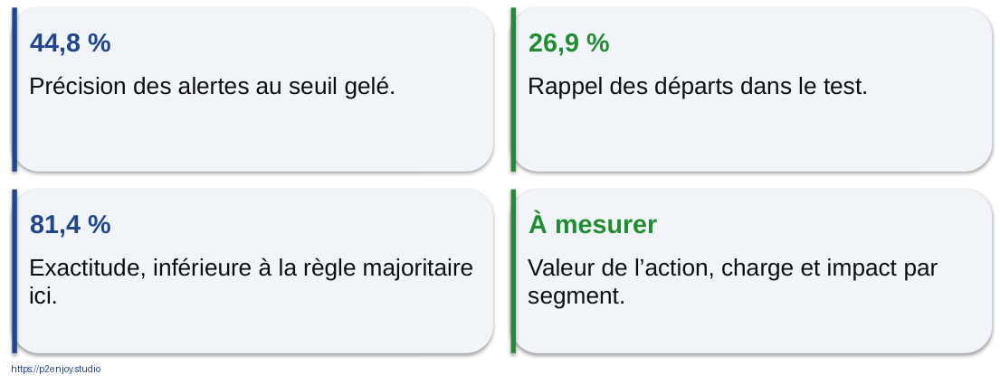

Figure J2-028. Interpréter sans masquer les limites. Schéma pédagogique original, version éditable dans le PowerPoint.

Question de relance  Quel chiffre montreriez-vous au manager en premier ?

Réponse attendue  La capacité et les conséquences de la politique, accompagnées de précision, rappel et limites, puis un protocole de mesure métier.

Message à faire retenir  Présenter les faiblesses fait partie du résultat, pas d’une annexe cachée.

Sources : [P01] Calculs reproductibles du TP Novalia

## J2-029 | Deep Learning : apprendre des représentations

[Séquence : B4.6] [Modalité : Apport] [Budget de la séquence : 20 min]

Entrées. Mesures, pixels ou tokens

Couches. Transformations paramétrées

Sortie. Prédiction ou représentation

Le réseau est une succession de transformations mathématiques apprises, pas un cerveau humain simplifié. Un neurone combine des valeurs avec des poids et un biais, puis applique une fonction. Plusieurs couches peuvent représenter des structures de plus en plus abstraites. Le nombre de couches ne garantit pas la qualité. L’intérêt est particulièrement visible sur des données riches, mais le choix reste empirique et contextualisé.

Question de relance  Qu’est-ce qui change pendant l’apprentissage ?

Réponse attendue  Les paramètres des transformations selon un objectif et un algorithme d’optimisation.

Message à faire retenir  Une représentation apprise n’est pas une explication humaine garantie.

Sources : [S05] LeCun, Bengio et Hinton : apprentissage profond

## J2-030 | Image, séquence, langage : des structures différentes

[Séquence : B4.6] [Modalité : Apport] [Budget de la séquence : 20 min]

Convolution. Exploiter des motifs locaux, notamment en vision.

Récurrence. Traiter une séquence en tenant compte d’un état.

Attention. Pondérer des éléments selon leur relation au contexte.

La présentation est volontairement intuitive. Les convolutions ont joué un rôle majeur en vision ; les récurrences ont longtemps structuré des approches de séquences ; l’article Transformer propose une architecture centrée sur l’attention. Ces familles coexistent et les usages dépassent cette classification simple. Les participants ne doivent pas mémoriser les équations, mais reconnaître pourquoi la forme des données influence l’architecture.

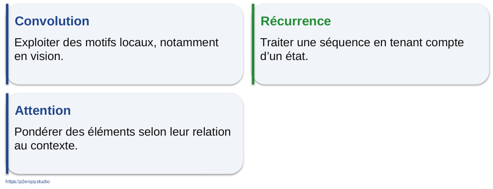

Figure J2-030. Image, séquence, langage : des structures différentes. Schéma pédagogique original, version éditable dans le PowerPoint.

Question de relance  Une table de dix variables exige-t-elle un Transformer ?

Réponse attendue  Pas par principe. Une méthode tabulaire simple peut être plus adaptée et plus facile à exploiter.

Message à faire retenir  L’architecture doit correspondre aux données et au besoin, pas à la tendance.

Sources : [S05] LeCun, Bengio et Hinton : apprentissage profond ; [S06] Vaswani et al. : Attention Is All You Need

## J2-031 | L’attention relie des éléments d’un contexte

[Séquence : B4.6] [Modalité : Apport] [Budget de la séquence : 20 min]

Phrase. Le client appelle car sa commande est en retard.

Contexte. Les représentations combinent différentes positions.

Prudence. Un poids d’attention ne prouve pas une causalité.

Le schéma montre des liens fictifs entre tokens pour illustrer le principe et non les poids d’un modèle réellement mesuré. L’attention calcule des combinaisons pondérées de représentations. Le Transformer originel introduit également des composants et des mécanismes de position ; ne pas réduire toute l’architecture à une simple surbrillance de mots importants. Faire le lien avec classification, recherche et génération.

Question de relance  L’illustration permet-elle de lire directement le raisonnement interne d’un modèle ?

Réponse attendue  Non. C’est une explication de mécanisme, pas une preuve d’interprétabilité d’une décision.

Message à faire retenir  Illustration conceptuelle, pas visualisation d’un modèle exécuté.

Sources : [S06] Vaswani et al. : Attention Is All You Need

## J2-032 | Générer, retrouver, agir : trois niveaux à contrôler

[Séquence : B4.6] [Modalité : Apport] [Budget de la séquence : 20 min]

Retrouver. Accéder à des contenus autorisés

Générer. Produire une réponse à vérifier

Agir. Appeler un outil avec des droits limités

L’IA générative est replacée dans le SI sans devenir le centre de la formation. Un assistant documentaire doit filtrer les droits avant la recherche et la restitution. Le fait de fournir des documents ne supprime pas les erreurs de génération. Lorsqu’un système appelle des outils, les permissions, validations et limites d’action doivent être vérifiées hors du modèle. Un contenu externe n’est pas une instruction de sécurité de confiance.

Question de relance  Pourquoi séparer droit de lire et droit d’agir ?

Réponse attendue  Un utilisateur peut avoir accès à une information sans être autorisé à déclencher une transaction.

Message à faire retenir  Une réponse plausible ne vaut ni vérité ni autorisation.

Sources : [S16] ANSSI : sécurité d’un système d’IA générative

## J2-033 | Du notebook au service exploité

[Séquence : B4.6] [Modalité : Apport] [Budget de la séquence : 20 min]

Données. Schéma et préparation versionnés

Modèle. Registre et validation

Service. API ou calcul planifié

Application. File et supervision

Exploitation. Journaux, alertes et repli

Le passage en production ajoute une discipline logicielle et opérationnelle. Il faut retrouver la version d’une prédiction, reproduire les transformations, surveiller les erreurs et revenir à une version antérieure. Le papier sur la dette technique des systèmes ML illustre pourquoi les dépendances et les boucles de données doivent être traitées à l’échelle du système. Le schéma est une architecture pédagogique, pas une obligation d’utiliser chaque outil du marché.

Figure J2-033. Du notebook au service exploité. Schéma pédagogique original, version éditable dans le PowerPoint.

Question de relance  Qu’est-ce qu’un prototype réussi ne prouve pas encore ?

Réponse attendue  Disponibilité, sécurité, robustesse aux changements, adoption et impact métier.

Message à faire retenir  Un fichier modèle n’est pas un service prêt à exploiter.

Sources : [S28] Sculley et al. : dette technique des systèmes ML

## J2-034 | Le monde change après le déploiement

[Séquence : B4.6] [Modalité : Apport] [Budget de la séquence : 20 min]

Données. Les entrées changent de distribution.

Relation. Le lien entre entrées et cible évolue.

Performance. Les métriques observées se dégradent.

Les trois dimensions sont liées mais non équivalentes. Un changement de données peut ne pas dégrader la performance ; une dégradation peut résulter d’un incident de pipeline plutôt que du modèle. Les labels peuvent arriver tard, ce qui retarde la mesure. Prévoir un suivi des entrées et des résultats, une revue humaine et un protocole de mise à jour. Réentraîner automatiquement sur des données douteuses peut aggraver un incident.

Question de relance  Une dérive déclenche-t-elle nécessairement un réentraînement immédiat ?

Réponse attendue  Non. Il faut diagnostiquer, vérifier les données et comparer des options avant une nouvelle validation.

Message à faire retenir  Surveiller → diagnostiquer → décider → valider, plutôt que réentraîner aveuglément.

Sources : [S28] Sculley et al. : dette technique des systèmes ML

## J2-035 | A09 • Transformer les scores en vue de décision

[Séquence : B4.7] [Modalité : TP] [Budget de la séquence : 35 min]

Entrée. predictions_powerbi.csv

Production. Quatre indicateurs et trois vues lisibles.

Contexte. Cohorte synthétique, date, version et seuil.

Action. Décrire le geste métier et le repli.

Prévoir trente-cinq minutes : cinq d’import, quinze de création, dix d’interprétation, cinq de revue. Power BI Desktop est utilisé lorsque le parc le permet. La variante sans code et sans Power BI consiste à travailler sur les CSV et la maquette fournie. Aucun fichier PBIX n’est prétendu livré ou testé. Les participants doivent comprendre que la vue présente un test indépendant, pas tous les clients de Novalia.

Question de relance  Quelle mention empêche de prendre cette vue pour un tableau de bord de production ?

Réponse attendue  « Cohorte de test synthétique », avec date des scores, version et périmètre.

Message à faire retenir  35 minutes • Cahier A09 • Les CSV de secours sont fournis.

## J2-036 | Importer sans altérer les chiffres

[Séquence : B4.7] [Modalité : TP] [Budget de la séquence : 35 min]

01. Importer le CSV UTF-8 avec séparateur virgule.

02. Utiliser une locale compatible avec les points décimaux.

03. Définir score : décimal ; alerte et cible : entier.

04. Nommer la table Predictions et vérifier 1 000 lignes.

05. Contrôler les totaux avant tout graphique.

Le CSV utilise des points décimaux. Une locale française appliquée sans vérification peut interpréter les types incorrectement. Dans Power Query, définir les types avec la locale appropriée, puis formater l’affichage en français. Le script M fourni est un exemple d’import à adapter au chemin du fichier. Son interface n’a pas été exécutée ici ; les fichiers de données et les totaux de référence sont disponibles pour vérifier le résultat.

Question de relance  Pourquoi contrôler le nombre de lignes avant de créer une visualisation ?

Réponse attendue  Pour détecter une erreur d’import, de filtre ou de dédoublonnage avant qu’un graphique la rende crédible.

Message à faire retenir  La qualité d’une visualisation commence à l’import.

Sources : [S26] Microsoft : scripts Python dans Power BI Desktop ; [P01] Calculs reproductibles du TP Novalia

## J2-037 | Maquette décisionnelle Novalia

[Séquence : B4.7] [Modalité : TP] [Budget de la séquence : 35 min]

Population. Test indépendant

Scores. Répartition du risque

Segments. Contrats et alertes

Traçabilité. Date et modèle

La maquette est construite à partir des exports du notebook, pas d’une capture de Power BI. Elle est entièrement modifiable dans le PowerPoint. Les graphiques portent sur une population synthétique de test. La somme du montant mensuel multiplié par le score est un indicateur pédagogique d’exposition estimée, pas un montant de perte certaine ni un revenu sauvable. Le formateur fait relier chaque visuel à une décision.

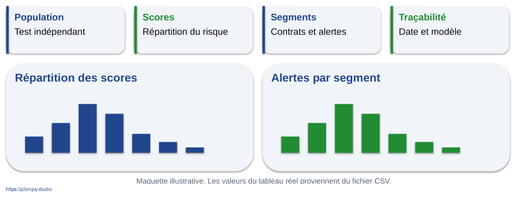

Figure J2-037. Maquette décisionnelle Novalia. Schéma pédagogique original, version éditable dans le PowerPoint.

Question de relance  Quelle vue permet de vérifier si un segment concentre trop d’alertes ?

Réponse attendue  Un tableau par segment indiquant effectif, taux d’alertes et résultats observés, sans se limiter au nombre brut.

Message à faire retenir  Maquette pédagogique alimentée par les fichiers joints, pas fichier PBIX.

Sources : [P01] Calculs reproductibles du TP Novalia

## J2-038 | Des mesures DAX simples et explicites

[Séquence : B4.7] [Modalité : TP] [Budget de la séquence : 35 min]

Comparer. Même périmètre de filtre.

Documenter. Unité, date et signification.

Les noms affichés sont ceux du fichier DAX fourni. Selon les paramètres régionaux de l’application, adapter les séparateurs d’arguments si nécessaire. Expliquer COUNTROWS, SUM et DIVIDE plutôt que faire mémoriser une syntaxe. L’exposition est calculée sur les montants disponibles et impute zéro aux absences uniquement pour cette démonstration ; le cahier demande d’indiquer cette limite et d’envisager une politique plus adaptée.

Question de relance  Un segment filtré garde-t-il la même signification que le total ?

Réponse attendue  Oui pour les mesures correctement définies, mais le périmètre doit être visible et les petits effectifs discutés.

Message à faire retenir  Fichier de mesures fourni • Vérifier les chiffres sur votre poste.

Sources : [S26] Microsoft : scripts Python dans Power BI Desktop ; [P01] Calculs reproductibles du TP Novalia

## J2-039 | Le dashboard n’est pas l’action

[Séquence : B4.7] [Modalité : TP] [Budget de la séquence : 35 min]

Voir. Un risque par segment

Comprendre. Sa fraîcheur et ses limites

Décider. Une politique de contact

Agir. Une file avec un responsable

Vérifier. Un effet réellement observé

Une vue réussie n’est pas seulement esthétique. Le participant doit indiquer ce qu’une personne fera après lecture. Les champs individuels ne sont pas obligatoires pour une vue de pilotage. Les droits doivent être définis si l’on descend au dossier. La disponibilité d’un score historique ne justifie pas de le réutiliser sans vérifier sa fraîcheur et son usage.

Question de relance  Quel message afficher si le score est trop ancien ?

Réponse attendue  Un statut explicite « données périmées » et une action de repli, pas le même indicateur sans avertissement.

Message à faire retenir  La restitution devient utile lorsqu’elle déclenche une décision maîtrisée.

# Ouverture des SI, contrats et résilience

[Bloc : B5] [Niveau : Application] [Fiches synchronisées avec les identifiants des diapositives]

## J2-041 | L’ouverture est bidirectionnelle

[Séquence : B5.1] [Modalité : Apport] [Budget de la séquence : 20 min]

Entrées. Météo, paiement, transport, capteurs

SI interne. Validation, données et modèles

Sorties. Prévisions agrégées, statuts et services

Un SI ouvert reçoit et fournit des ressources selon des droits. Les flux entrants apportent du contexte ; les sortants permettent de coordonner un écosystème ou de créer un service. Une sortie peut être agrégée plutôt que brute. Pour chaque flux, noter finalité, source, destinataire, fréquence, sécurité et responsabilité. Une base interne ne doit pas être exposée directement pour éviter de concevoir une interface.

Question de relance  Que peut-on fournir à un fournisseur sans lui donner les clients individuels ?

Réponse attendue  Une prévision agrégée par produit et période, si le besoin, les droits et les risques le permettent.

Message à faire retenir  Ouvrir une capacité de service, pas toute la base de données.

## J2-042 | Quatre modes d’échange à savoir choisir

[Séquence : B5.1] [Modalité : Apport] [Budget de la séquence : 20 min]

| Mode | Déclenchement | Usage typique |
| --- | --- | --- |
| Fichier batch | À heure planifiée | Prévisions quotidiennes |
| API | À la demande | Consulter un statut |
| Webhook | À la survenue d’un fait | Livraison effectuée |
| Flux d’événements | En continu | Télémétrie et traitements réactifs |

Les modes ne sont pas classés du moins au plus moderne. Le choix dépend de fraîcheur, volume, couplage, coût et criticité. Un webhook est un appel déclenché par un événement ; il n’est pas équivalent à un bus d’événements complet. Un fichier planifié peut être parfaitement adapté à un calcul nocturne. La méthode doit rester compréhensible par le responsable métier.

Question de relance  Pourquoi ne pas choisir le temps réel par défaut ?

Réponse attendue  Il peut ajouter des coûts et des contraintes sans améliorer une décision qui n’est prise qu’une fois par jour.

Message à faire retenir  La fréquence de décision justifie la fréquence de circulation.

## J2-043 | La latence utile dépend du métier

[Séquence : B5.1] [Modalité : Apport] [Budget de la séquence : 20 min]

Jour. Prévision de stock

Heure. Planification

Minute. Suivi opérationnel

Seconde. Interaction client

Milliseconde. Certains contrôles de paiement

Les positions sont illustratives et non des engagements de service de fournisseurs. Une application conversationnelle peut accepter quelques secondes, tandis qu’un contrôle dans un paiement impose souvent une contrainte plus forte. Une prévision nocturne n’a pas besoin de répondre à chaque clic. Faire évaluer ce qui se passe lorsque le résultat arrive trop tard : devient-il inutile, dangereux ou simplement moins confortable ?

Question de relance  La vitesse de calcul est-elle le seul facteur de latence ?

Réponse attendue  Non. Collecte, préparation, réseau, file d’attente, service et action humaine participent au délai total.

Message à faire retenir  Une prédiction utile doit arriver avant que la décision ne soit devenue irréversible.

## J2-044 | UPS : le réseau logistique comme système de données

[Séquence : B5.1] [Modalité : Apport] [Budget de la séquence : 20 min]

Données. Flux de colis, installations et modes de transport.

Contexte. Météo, volumes et retards.

Simulation. Explorer des scénarios avant la perturbation.

Décision. Adapter l’organisation du réseau.

Le communiqué UPS du 18 juin 2026 décrit un jumeau numérique du réseau et l’intégration de données opérationnelles pour anticiper les perturbations. Il s’agit d’une annonce de l’entreprise, pas d’une évaluation indépendante de chaque composant. Le dessin du cours est conceptuel. La leçon porte sur le couplage entre signaux externes, représentation du réseau et décisions de planification.

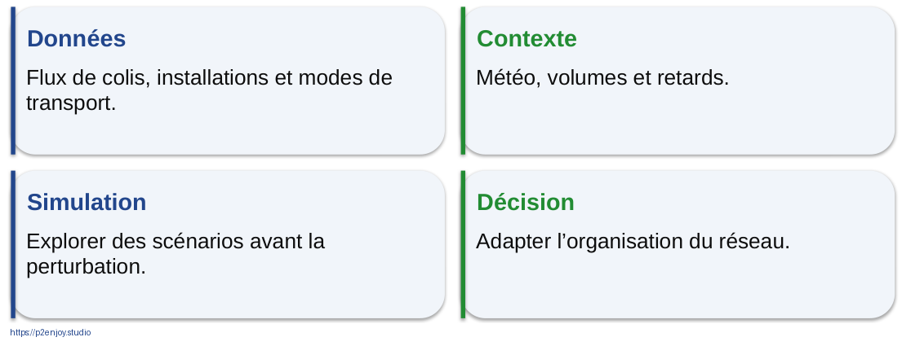

Figure J2-044. UPS : le réseau logistique comme système de données. Schéma pédagogique original, version éditable dans le PowerPoint.

Question de relance  Quelle donnée extérieure peut être utile seulement pendant quelques heures ?

Réponse attendue  Une prévision météo, un incident de trafic ou une estimation de retard.

Message à faire retenir  Cas documenté • UPS, 18 juin 2026 • Architecture schématique

Sources : [S12] UPS : initiatives IA et jumeau numérique

## J2-045 | Un jumeau numérique n’est pas une simple image 3D

[Séquence : B5.1] [Modalité : Apport] [Budget de la séquence : 20 min]

Système réel. Dépôts, véhicules et colis

État observé. Mesures et événements

Représentation. Modèle numérique du réseau

Scénarios. Conséquences de décisions possibles

Expliquer la différence entre un dessin statique et une représentation reliée à des états observés. La fidélité requise dépend de la décision. Le communiqué UPS annonce une actualisation de son jumeau à intervalles de dix minutes ; ne pas en déduire que toutes les données d’un tel système sont synchrones à la seconde. Une simulation ne supprime pas les incertitudes ni les données manquantes.

Question de relance  Que faut-il connaître avant de croire une simulation ?

Réponse attendue  Hypothèses, données d’entrée, validité du modèle, incertitude et limites d’usage.

Message à faire retenir  Le jumeau vaut par sa relation au réel et à la décision qu’il permet d’évaluer.

Sources : [S12] UPS : initiatives IA et jumeau numérique

## J2-046 | Le fournisseur externe devient une dépendance

[Séquence : B5.1] [Modalité : Apport] [Budget de la séquence : 20 min]

Service nominal. Donnée fraîche, schéma valide et accès autorisé.

Service dégradé. Source absente, retardée ou incohérente.
La décision doit rester explicite.

Imaginer que l’API météo ne répond plus. Remplacer la pluie inconnue par zéro transformerait une absence de connaissance en une observation fausse. Une option est d’utiliser un modèle sans météo, une source secondaire ou une dernière valeur encore acceptable selon une durée définie. Chaque repli doit avoir été validé. Le service utilisateur doit indiquer son statut, pas masquer le défaut.

Question de relance  Qu’est-ce qu’un bon mode dégradé ?

Réponse attendue  Une alternative connue, déclenchée par une condition observable, avec un responsable et des limites communiquées.

Message à faire retenir  L’absence de donnée n’est pas une valeur métier.

## J2-047 | A10 • Concevoir le SI ouvert de Novalia

[Séquence : B5.2] [Modalité : TP] [Budget de la séquence : 45 min]

Besoin. Mieux prévoir la demande et les livraisons.

Entrées. Commandes, stocks, météo et transporteurs.

Sorties. Prévisions agrégées pour les fournisseurs.

Livrable. Architecture, fréquences, droits et mode dégradé.

Consacrer quarante-cinq minutes : cinq au cadrage, vingt au dessin, dix au contrôle croisé et dix au test d’un parcours. Les groupes reprennent leur carte initiale et ajoutent au moins une source entrante et une capacité sortante. Le modèle ML est identifié par sa famille ; il n’est pas nécessaire de le développer dans ce bloc. Interdire le partage de données individuelles lorsqu’aucun besoin ne le justifie.

Question de relance  Quel flux élimineriez-vous si sa valeur n’est pas démontrée ?

Réponse attendue  Tout flux dont le lien avec une décision ou un engagement de service reste non établi.

Message à faire retenir  45 minutes • Cahier A10 • Un flux entrant et un flux sortant justifiés

## J2-048 | Architecture cible : des frontières visibles

[Séquence : B5.2] [Modalité : TP] [Budget de la séquence : 45 min]

Externe. Sources et partenaires

Entrée contrôlée. Passerelle, identité et validation

Données. Stockage, qualité et transformations

Modèle. Calcul planifié ou inférence

Métier. Application et supervision

Sortie contrôlée. Agrégats et services autorisés

Le schéma propose des fonctions, pas une liste d’achats. Certaines peuvent être assurées par un même composant dans une petite architecture. Le contrôle d’accès doit s’appliquer aux entrées et aux sorties. L’observabilité traverse le système. Les secrets ne sont pas inscrits dans le notebook ni dans le diaporama. Le modèle n’accède qu’aux données nécessaires à sa tâche.

Question de relance  Où vérifier qu’un partenaire ne lit que ses données ?

Réponse attendue  Dans la couche d’autorisation du service et les requêtes, avec tests d’isolation, pas dans une simple consigne au modèle.

Message à faire retenir  Architecture pédagogique • Chaque frontière correspond à un contrôle à définir.

## J2-049 | Décrire chaque flèche comme un contrat

[Séquence : B5.2] [Modalité : TP] [Budget de la séquence : 45 min]

| Flux | Fréquence | Donnée minimale | Responsable |
| --- | --- | --- | --- |
| Transporteur → Novalia | Événement | Statut et identifiant utile | Service logistique |
| Météo → Novalia | Périodique | Zone, prévision, date | Propriétaire du flux |
| Novalia → fournisseur | Quotidien | Produit, semaine, quantité | Achats / SI |
| Modèle → application | Selon besoin | Score, date, version | Propriétaire du service |

Le tableau est une correction possible, sans imposer une cadence universelle. Les quantités minimales dépendent du besoin. Exiger pour chaque flux une gestion d’échec, une règle de fraîcheur et un contrat de schéma. Un identifiant pseudonyme reste potentiellement une donnée personnelle selon le contexte et les possibilités de rattachement. Les partenaires ne doivent pas choisir librement de nouvelles finalités à partir d’un accès existant.

Question de relance  Quelle information manque à un score seul ?

Réponse attendue  Sa date, sa version, la définition de sa cible, les limites de validité et la politique d’usage.

Message à faire retenir  Nommer les données qui circulent révèle les risques cachés derrière une flèche.

## J2-050 | Revue croisée : suivre un événement de bout en bout

[Séquence : B5.2] [Modalité : TP] [Budget de la séquence : 45 min]

01. Un transporteur signale un retard.

02. Novalia valide le schéma et l’autorisation.

03. Les données utiles sont mises à jour.

04. Une estimation est recalculée si nécessaire.

05. Une personne reçoit un dossier exploitable.

Le groupe voisin joue le rôle d’un auditeur métier. Il suit un événement concret et demande à chaque étape ce qui peut échouer. Faire vérifier l’identifiant d’événement pour éviter les doublons et l’ordre temporel des messages. Une livraison reçue deux fois ne doit pas déclencher deux notifications identiques ou deux compensations. La complexité doit être introduite par l’exemple plutôt que par une liste abstraite de technologies.

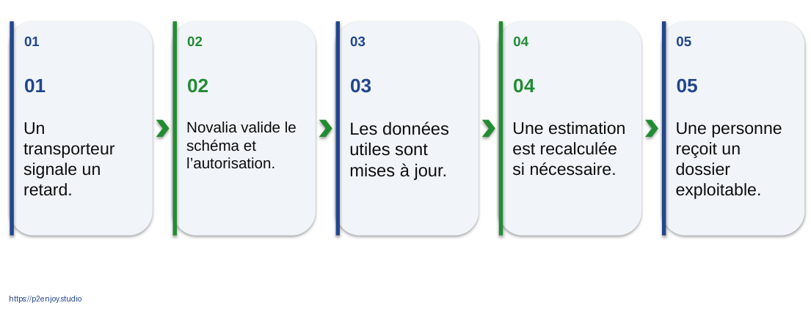

Figure J2-050. Revue croisée : suivre un événement de bout en bout. Schéma pédagogique original, version éditable dans le PowerPoint.

Question de relance  Comment éviter qu’un même événement déclenche deux fois l’action ?

Réponse attendue  Conserver un identifiant et une logique d’idempotence ou de déduplication appropriée.

Message à faire retenir  Une architecture se vérifie en racontant un parcours précis.

## J2-051 | Une API expose un service, pas un mot de passe

[Séquence : B5.3] [Modalité : Apport] [Budget de la séquence : 20 min]

Application. Demande une capacité

Autorisation. Reçoit des droits limités

Passerelle. Contrôle accès et volume

Service. Vérifie le périmètre

Réponse. Retourne le minimum utile

OAuth 2.0 est un cadre d’autorisation. Il ne doit pas être présenté à lui seul comme un protocole complet d’authentification d’utilisateur ; l’identité peut s’appuyer sur d’autres mécanismes tels qu’OpenID Connect selon le système. Un jeton donne des droits limités et doit être protégé. Les secrets restent côté service. La vérification des droits doit inclure l’objet demandé et pas seulement l’existence d’un jeton valide.

Question de relance  Un jeton valide permet-il de consulter n’importe quel client ?

Réponse attendue  Non. L’autorisation doit porter sur l’action et les ressources autorisées.

Message à faire retenir  Authentifier une identité et autoriser une action sont deux questions différentes.

Sources : [S24] IETF : cadre d’autorisation OAuth 2.0

## J2-052 | John Deere : un exemple d’écosystème contrôlé

[Séquence : B5.3] [Modalité : Apport] [Budget de la séquence : 20 min]

Principe. Des applications accèdent à des services documentés.

Mécanisme. API, clés d’application et OAuth 2 selon le flux.

Contrôle. Périmètre d’autorisation et révocation.

Leçon. L’ouverture utile peut rester strictement limitée.

La documentation John Deere consultée illustre des API avec un mécanisme OAuth 2. La page utilisée concerne des services spécifiques ; ne pas attribuer ce même flux à tous les endpoints de l’écosystème. Le but est de montrer que connecter des partenaires demande une identité d’application, des droits et une gestion de cycle de vie. Ce micro-cas ne constitue pas une étude de performance de Machine Learning.

Question de relance  Pourquoi un partenaire ne doit-il pas recevoir un accès SQL global ?

Réponse attendue  Il contournerait les limites de service, la minimisation, le versionnement et le contrôle d’usage.

Message à faire retenir  Micro-cas d’API documenté, pas preuve d’un bénéfice ML.

Sources : [S14] John Deere : documentation des API et OAuth 2 ; [S24] IETF : cadre d’autorisation OAuth 2.0

## J2-053 | La partie visible d’une API est la plus petite

[Séquence : B5.3] [Modalité : Apport] [Budget de la séquence : 20 min]

Visible. Endpoint, requête, réponse

Invisible. Qualité, contrat, droits, sécurité

Exploitation. Quotas, versions, incidents, réversibilité

L’iceberg est une analogie originale. La syntaxe d’une requête ne dit pas qui porte le coût de l’indisponibilité, qui peut réutiliser les données ou comment retirer l’accès. Une interface stable exige une gestion de versions. Une nouvelle finalité d’entraînement ne doit pas être déduite automatiquement d’un droit de consultation. Faire distinguer contrat juridique et contrat technique de schéma, tous deux nécessaires selon le contexte.

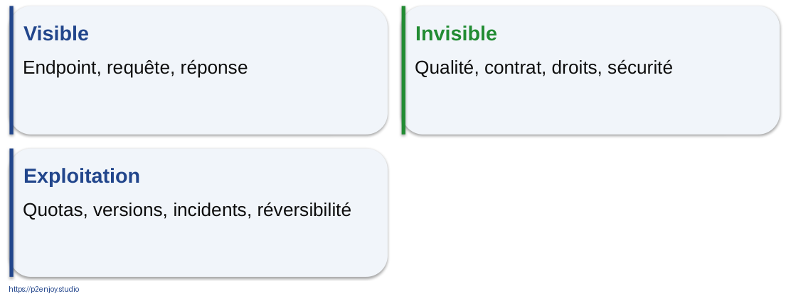

Figure J2-053. La partie visible d’une API est la plus petite. Schéma pédagogique original, version éditable dans le PowerPoint.

Question de relance  Quelle question poser avant d’utiliser les données d’un partenaire pour entraîner un modèle ?

Réponse attendue  Vérifier les droits et finalités de réutilisation, les personnes concernées et les obligations contractuelles ou légales.

Message à faire retenir  « Nous avons une API » ne signifie pas « nous maîtrisons l’échange ».

Sources : [S22] Commission européenne : règlement sur les données ; [S24] IETF : cadre d’autorisation OAuth 2.0

## J2-054 | Un contrat de données comporte quatre couches

[Séquence : B5.3] [Modalité : Apport] [Budget de la séquence : 20 min]

Sens. Définition, unité, finalité, propriétaire.

Structure. Schéma, types, identifiants et versions.

Service. Fraîcheur, disponibilité, quotas et incidents.

Droits. Accès, conservation, réutilisation et sortie.

Donner l’exemple d’une température : un nombre valide peut être en Fahrenheit plutôt qu’en Celsius. Le schéma doit donc expliciter l’unité et pas seulement le type float. Une modification compatible syntaxiquement peut rester incompatible sémantiquement. Le contrat précise comment annoncer le changement, tester et revenir en arrière. La durée de conservation des journaux doit également être maîtrisée.

Question de relance  Quel changement ne serait pas détecté par un simple test de type ?

Réponse attendue  Un changement d’unité ou de définition métier.

Message à faire retenir  Un schéma valide n’est pas encore une donnée correcte.

## J2-055 | Data Act et gouvernance du partage

[Séquence : B5.3] [Modalité : Apport] [Budget de la séquence : 20 min]

Data Act. Accès et usage de certaines données, notamment de produits connectés.
Application depuis le 12 septembre 2025, selon dispositions.

Data Governance Act. Cadre facilitant certaines formes de partage et de réutilisation.
Ne remplace pas les droits et obligations existants.

La Commission présente le Data Act comme un cadre d’accès et d’usage équitables des données, incluant les dispositifs connectés et des questions de services. Le champ, les dates particulières et les exceptions doivent être examinés. Il ne crée pas un droit illimité de collecter tout ce qui est techniquement accessible. Le Data Governance Act apporte d’autres mécanismes de confiance. Le RGPD reste pertinent pour les données personnelles.

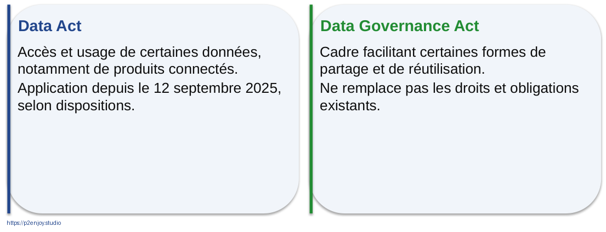

Figure J2-055. Data Act et gouvernance du partage. Schéma pédagogique original, version éditable dans le PowerPoint.

Question de relance  L’application du Data Act dispense-t-elle de vérifier la confidentialité et les données personnelles ?

Réponse attendue  Non. L’accès, le droit d’usage, les secrets et la protection des personnes doivent être articulés.

Message à faire retenir  Sensibilisation au 14 septembre 2026, à faire qualifier selon le cas réel.

Sources : [S22] Commission européenne : règlement sur les données ; [S23] Commission européenne : gouvernance des données

## J2-056 | Huit contrôles avant d’exposer un service IA

[Séquence : B5.3] [Modalité : Apport] [Budget de la séquence : 20 min]

Accès. Identité, droits et isolation.

Entrées. Schéma, taille et limites.

Secrets. Stockage adapté et rotation.

Volume. Quotas et limitation de débit.

Sorties. Minimisation et validation.

Suivi. Traces, alertes et révocation.

Les six cartouches regroupent huit contrôles : identité, autorisation, validation des entrées, gestion des secrets, quotas, contrôle des sorties, journalisation et révocation. Les menaces dépendent de l’architecture. Un système qui propose des actions ne doit pas les exécuter avec des privilèges globaux. Pour un service sensible, les tests doivent couvrir les erreurs, les cas limites et l’isolation entre partenaires. Les descriptions restent défensives et non opérationnelles pour l’attaque.

Question de relance  Quel contrôle doit rester actif même si le modèle est très performant ?

Réponse attendue  Tous les contrôles d’accès et d’usage : la performance statistique ne donne aucun droit supplémentaire.

Message à faire retenir  La sécurité de l’interface ne dépend pas de la bonne volonté du modèle.

Sources : [S16] ANSSI : sécurité d’un système d’IA générative ; [S24] IETF : cadre d’autorisation OAuth 2.0

## J2-057 | A11 • Écrire le contrat avant de brancher

[Séquence : B5.4] [Modalité : TP] [Budget de la séquence : 35 min]

Objet. Prévision météo entrante ou prévision fournisseur sortante.

À préciser. Schéma, unité, fraîcheur, droits et disponibilité.

À tester. Champ absent, version changée, donnée trop ancienne.

Livrable. Une page de contrat et trois tests d’acceptation.

Allouer trente-cinq minutes : dix au sens et aux droits, dix au schéma et au service, dix aux tests, cinq à la revue. Le notebook de simulation locale constitue une option d’appui, pas un prérequis réseau. Faire écrire une erreur attendue et une réponse de repli pour chaque test. Un contrat qui ne prévoit que le succès nominal est incomplet.

Question de relance  Quelle réponse attend-on lorsque la météo est trop ancienne ?

Réponse attendue  Un statut explicite et un repli validé, sans remplacer silencieusement la donnée par une valeur inventée.

Message à faire retenir  35 minutes • Cahier A11 • Simulation locale facultative incluse

## J2-058 | Exemple : un message minimal et vérifiable

[Séquence : B5.4] [Modalité : TP] [Budget de la séquence : 35 min]

Sens. Précipitation prévue, zone et unité explicites.

Contrôle. Version, horodatage et domaine de valeurs.

Le message est fictif et utilisé dans le notebook sans aucun appel à un fournisseur réel. Il faut préciser dans le contrat la période de prévision, qui n’est pas complète dans ce message minimal : c’est un point d’amélioration volontaire du groupe. L’horodatage indique la génération et non automatiquement la période couverte. Ajouter l’horizon avant de considérer le contrat exploitable dans un vrai SI.

Question de relance  Quel champ manque pour savoir pour quelle période la pluie est prévue ?

Réponse attendue  Un début et une fin de validité ou un horizon explicitement défini dans le contrat.

Message à faire retenir  Exemple minimal de laboratoire, à compléter avant un usage réel.

## J2-059 | Quatre tests de contrat, quatre décisions explicites

[Séquence : B5.4] [Modalité : TP] [Budget de la séquence : 35 min]

| Entrée | Statut attendu | Décision |
| --- | --- | --- |
| Valide et fraîche | ACCEPTE | Utiliser la donnée |
| Version 2 inattendue | VERSION_INCOMPATIBLE | Repli et signalement |
| Date ancienne | DONNEE_NON_FRAICHE | Repli et signalement |
| Pluie négative | VALEUR_HORS_DOMAINE | Rejet et diagnostic |

Le notebook de simulation joint vérifie ces quatre cas et a été exécuté. Ce n’est pas un service sécurisé complet : il ne réalise ni OAuth, ni TLS, ni quotas, ni déploiement. L’exercice sert à relier une condition de qualité à une réponse déterministe. Le groupe peut ajouter un test d’unité, de délai réseau ou de champ personnel inattendu. Les seuils retenus sont des hypothèses pédagogiques.

Question de relance  Pourquoi écrire les statuts avant le déploiement ?

Réponse attendue  Pour que les consommateurs et les opérateurs sachent distinguer les erreurs et appliquer le bon repli.

Message à faire retenir  Simulation exécutable locale • Aucun réseau ni secret réel

Sources : [P01] Calculs reproductibles du TP Novalia

## J2-060 | Partager moins peut créer autant de valeur

[Séquence : B5.4] [Modalité : TP] [Budget de la séquence : 35 min]

Partage excessif. Tous les clients, toutes les commandes, tous les historiques.

Partage ciblé. Quantité attendue par produit et semaine, périmètre contractuel et contrôles.

La minimisation peut également simplifier l’intégration, limiter le risque et réduire le couplage. Mais une agrégation n’est pas automatiquement anonyme : de petits groupes peuvent révéler une personne ou une information confidentielle. Le choix du niveau d’agrégation doit tenir compte du besoin et des risques. Faire expliciter les droits d’entraînement d’un modèle à partir des agrégats plutôt que de les supposer.

Question de relance  Quelle granularité suffit à un fournisseur pour planifier sa production ?

Réponse attendue  Une prévision par produit et période peut suffire, sans identification individuelle des clients, selon le cas.

Message à faire retenir  La donnée fournie doit répondre au besoin, pas à la curiosité du destinataire.

Sources : [S15] CNIL : fiches pratiques IA ; [S22] Commission européenne : règlement sur les données

## J2-061 | A12 • Votre architecture reçoit un incident

[Séquence : B5.5] [Modalité : TP] [Budget de la séquence : 30 min]

Déclencheur. Une carte incident par groupe.

Réponse. Impact → détection → repli → responsable.

Contrôle. Vérifier les traces et le retour au service nominal.

Livrable. Une fiche de réponse utilisable par un opérateur.

Prévoir trente minutes : cinq pour tirer et lire la carte, dix pour décider, dix pour un échange contradictoire et cinq pour documenter. Les scénarios sont simulés. Le groupe ne doit pas improviser des actions risquées ; il décrit une procédure défensive et proportionnée. La suspension d’un accès n’est utile que si les équipes savent maintenir le processus métier autrement.

Question de relance  Quelle décision ne doit pas être prise automatiquement après l’incident ?

Réponse attendue  La reprise complète si les conditions de sécurité, de qualité et de responsabilité ne sont pas rétablies.

Message à faire retenir  30 minutes • Cahier A12 • Cartes incident imprimables fournies

## J2-062 | Sept situations de rupture

[Séquence : B5.5] [Modalité : TP] [Budget de la séquence : 30 min]

Source. API indisponible ou schéma changé.

Charge. Volume multiplié par dix.

Données. Information personnelle inattendue.

Modèle. Rappel fortement dégradé.

Partenaire. Demande de données brutes.

Accès. Jeton compromis ou usage hors périmètre.

Les sept cartes détaillées se trouvent dans le cahier : l’indisponibilité et le changement de schéma sont deux cartes distinctes. Demander aux groupes de ne pas confondre incident technique et demande de nouveau droit. Une demande de données brutes peut être un changement contractuel, pas une panne. La dégradation de rappel nécessite des étiquettes observées et une vérification de leur qualité.

Question de relance  Quelle alerte est impossible à calculer immédiatement si la cible arrive dans 30 jours ?

Réponse attendue  Le rappel réel sur les décisions du jour ; il faut d’abord suivre des indicateurs précoces puis les labels arrivés à maturité.

Message à faire retenir  L’incident révèle ce que le diagramme nominal ne montrait pas.

## J2-063 | Un repli se prépare et se termine

[Séquence : B5.5] [Modalité : TP] [Budget de la séquence : 30 min]

Détecter. Condition et alerte

Contenir. Limiter les effets

Continuer. Mode métier dégradé

Diagnostiquer. Cause et périmètre

Rétablir. Critères de reprise

Apprendre. Tests et documentation

Le retour au nominal doit être soumis à des critères. Une API qui répond de nouveau peut servir une mauvaise version ou des données corrompues. Les journaux doivent permettre l’analyse sans exposer inutilement des informations sensibles. Après incident, revoir les tests de contrat et les dépendances. Le cycle est une proposition de procédure à adapter au plan de réponse de l’organisation.

Question de relance  Qu’est-ce qui prouve que le service peut reprendre ?

Réponse attendue  Tests de qualité et de sécurité, résultat de contrôle, autorisation du responsable et surveillance renforcée selon le cas.

Message à faire retenir  La reprise est une décision vérifiée, pas le simple retour d’un voyant vert.

Sources : [S16] ANSSI : sécurité d’un système d’IA générative ; [S28] Sculley et al. : dette technique des systèmes ML

## J2-064 | Restitution : défendre votre système en trois minutes

[Séquence : B5.6] [Modalité : Évaluation] [Budget de la séquence : 30 min]

30 secondes. Le problème et le résultat métier attendu.

60 secondes. Données, modèle, architecture et flux.

45 secondes. Gouvernance, risques et mode dégradé.

45 secondes. Mesures, validation et prochaine décision.

Le dispositif de référence prévoit jusqu’à quatre groupes : trois minutes chacun et trois minutes de retour collectif dans une fenêtre de quinze minutes. Pour un groupe plus grand, utiliser une galerie de restitution parallèle plutôt que dépasser le budget. Le formateur utilise la grille du cahier corrigé. La note individuelle ne dépend pas uniquement du pitch du groupe : le QCM et la fiche de transfert complètent la preuve.

Question de relance  Quel point pourriez-vous défendre avec une preuve plutôt qu’une promesse ?

Réponse attendue  Le schéma de flux, les règles de qualité, un calcul reproductible ou un protocole de mesure clairement défini.

Message à faire retenir  15 minutes au total • Quatre groupes maximum en restitution successive

## J2-065 | Évaluation finale : appliquer les distinctions

[Séquence : B5.6] [Modalité : Évaluation] [Budget de la séquence : 30 min]

1 à 3. Cible, temporalité et référence simple.

4 à 6. Précision, seuil et test indépendant.

7 à 9. API, droits et gouvernance.

10 à 12. Dérive, repli et impact métier.

Distribuer le QCM final de douze questions et accorder dix minutes. Les réponses et justifications détaillées figurent uniquement dans le guide formateur. Éviter une correction collective qui révèle les réponses avant remise. Chaque question vaut un point pour le diagnostic individuel. La grille de cas sur cent points est un outil pédagogique distinct, et non une certification officielle liée à un seuil contractuel.

Question de relance  Quel raisonnement justifie votre réponse lorsque deux options semblent proches ?

Réponse attendue  Revenir au moment de la décision, au rôle de la mesure ou à la responsabilité de l’action.

Message à faire retenir  10 minutes • QCM individuel • Corrigé dans le guide formateur

## J2-066 | Votre prochain cas d’usage, sur une page

[Séquence : B5.6] [Modalité : Évaluation] [Budget de la séquence : 30 min]

Décision. Ce que je veux améliorer

Données. Ce qui existe réellement

Utilisateur. Qui peut agir

Méthode. Ce qui est plausible

Mesure. Ce que je vérifierai

Risques. Ce qui peut mal se passer

Responsable. Qui doit arbitrer

Intégration. Où le résultat arrive

Étape suivante. Une vérification concrète

Réserver cinq minutes de transfert individuel. Le participant choisit un cas réel sans partager de données confidentielles. Il note une première vérification à effectuer et un point qui nécessite une expertise complémentaire. Le support ne se termine pas par une promesse sur l’avenir de l’IA : il se termine sur une décision praticable. Ne pas imposer le lancement d’un projet si un recadrage ou un abandon est plus justifié.

Question de relance  Quelle vérification précise pouvez-vous lancer sans développer de modèle ?

Réponse attendue  Par exemple vérifier l’existence et la date des données, identifier le propriétaire du processus ou mesurer la baseline.

Message à faire retenir  5 minutes • Fiche individuelle de transfert • Un fait à vérifier avant le prototype

# Corrigés et critères des travaux pratiques

## A01 | Classer huit situations métier

[Durée cumulée : 30 min] [Réussite : Une proposition de famille de traitement est justifiée par la question, la cible et l’usage.]

Classification supervisée si les cas historiques sont étiquetés ; recommandation pour le commerce ; régression ou prévision temporelle pour les ventes ; détection d’anomalies pour les journaux ; règles déterministes pour un seuil contractuel stable. Accepter les variantes justifiées. Un simple classement documentaire RH n’équivaut pas à une décision automatisée sur les personnes.

Évaluation formative  Vérifier l’argumentation, le lien avec une action et l’identification des limites. Une alternative techniquement plausible et correctement justifiée peut être acceptée. Une réponse vague contenant uniquement un nom d’outil est insuffisante.

## A02 | Cartographier la chaîne de décision Novalia

[Durée cumulée : 30 min] [Réussite : Un autre groupe peut suivre un dossier de sa source à la mesure du résultat.]

Exemple : ticket entrant et texte disponible à t₀ ; nettoyage et contrôle des droits ; classification de l’équipe ; proposition au conseiller, avec revue si faible confiance ; mesure du temps de routage, de la réaffectation et du délai total. Une catégorie connue seulement après clôture peut servir de cible, pas d’entrée à t₀.

Évaluation formative  Vérifier l’argumentation, le lien avec une action et l’identification des limites. Une alternative techniquement plausible et correctement justifiée peut être acceptée. Une réponse vague contenant uniquement un nom d’outil est insuffisante.

## A03 | Comparer Netflix et Google Play

[Durée cumulée : 30 min] [Réussite : L’analyse distingue le modèle, le système de recommandation et la preuve d’impact.]

Ne pas résumer Netflix à un algorithme unique. Ne pas présenter les résultats historiques de Google Play comme une promesse de gain pour Novalia. Une meilleure métrique hors ligne doit être confrontée à l’expérience réelle. Surveiller pertinence, diversité, exposition et satisfaction plutôt que le seul clic.

Évaluation formative  Vérifier l’argumentation, le lien avec une action et l’identification des limites. Une alternative techniquement plausible et correctement justifiée peut être acceptée. Une réponse vague contenant uniquement un nom d’outil est insuffisante.

## A04 | Arbitrer les erreurs de fraude

[Durée cumulée : 30 min] [Réussite : Le choix est étayé par le calcul et la capacité opérationnelle, pas par l’exactitude seule.]

A : 80 / 480 = 16,7 % de précision ; 80 % de rappel ; 20 × 100 + 400 × 5 = 4 000 € ; 480 alertes. B : 65 / 165 = 39,4 % ; 65 % ; 35 × 100 + 100 × 5 = 4 000 € ; 165 alertes. Avec un faux positif à 10 €, A coûte 6 000 € et B 4 500 €. Ce calcul compare des hypothèses, il ne mesure pas un gain commercial observé.

Évaluation formative  Vérifier l’argumentation, le lien avec une action et l’identification des limites. Une alternative techniquement plausible et correctement justifiée peut être acceptée. Une réponse vague contenant uniquement un nom d’outil est insuffisante.

## A05 | Rédiger le canevas de valeur des données

[Durée cumulée : 30 min] [Réussite : La proposition relie problème, action et indicateur métier mesurable.]

Exemple churn : l’équipe de fidélisation reçoit chaque nuit une file priorisée. La précision du score n’est pas la rétention incrémentale. Le KPI métier demande une comparaison pertinente avec un groupe témoin ou une autre méthode d’évaluation de l’action. Expliciter coût du contact, remise, délai et capacité.

Évaluation formative  Vérifier l’argumentation, le lien avec une action et l’identification des limites. Une alternative techniquement plausible et correctement justifiée peut être acceptée. Une réponse vague contenant uniquement un nom d’outil est insuffisante.

## A06 | Auditer la qualité et la disponibilité temporelle

[Durée cumulée : 35 min] [Réussite : Les anomalies sont associées à des règles testables et à un propriétaire.]

Défauts intentionnels : montant négatif, ancienneté négative, catégorie « Mensuel » avec espaces et casse, satisfaction hors domaine, identifiant dupliqué, valeur manquante, date de rafraîchissement ancienne. La date de demande de résiliation est postérieure au snapshot pour certains dossiers : l’utiliser comme caractéristique pour anticiper le départ produirait une fuite d’information.

Évaluation formative  Vérifier l’argumentation, le lien avec une action et l’identification des limites. Une alternative techniquement plausible et correctement justifiée peut être acceptée. Une réponse vague contenant uniquement un nom d’outil est insuffisante.

## A07 | Attribuer les responsabilités et traiter les risques

[Durée cumulée : 45 min] [Réussite : Chaque arbitrage possède un responsable et une procédure utilisable.]

La finalité et le seuil relèvent d’un propriétaire métier désigné, la réalisation data des équipes habilitées et l’exploitation d’une équipe SI. Le DPO et le RSSI sont consultés selon leurs compétences ; ils ne remplacent pas automatiquement le propriétaire du service. Chaque risque a un contrôle, un indicateur, un responsable et un critère de suspension.

Évaluation formative  Vérifier l’argumentation, le lien avec une action et l’identification des limites. Une alternative techniquement plausible et correctement justifiée peut être acceptée. Une réponse vague contenant uniquement un nom d’outil est insuffisante.

## A08 | Explorer, entraîner, choisir puis évaluer

[Durée cumulée : 75 min] [Réussite : Les décisions de modèle et de seuil sont prises sans exploiter le test final.]

Le jeu compte 5000 clients synthétiques et 17.48 % de départs. La séparation est 3 000 / 1 000 / 1 000. La référence retient la régression logistique selon la précision moyenne sur validation. Le seuil 0.383580, décidé sur validation, signale 105 clients sur test. Matrice : 767 vrais négatifs, 58 faux positifs, 128 faux négatifs et 47 vrais positifs. Précision 44,76 %, rappel 26,86 %. Ne pas modifier la politique sur ce même test pour obtenir a posteriori 100 alertes.

Évaluation formative  Vérifier l’argumentation, le lien avec une action et l’identification des limites. Une alternative techniquement plausible et correctement justifiée peut être acceptée. Une réponse vague contenant uniquement un nom d’outil est insuffisante.

## A09 | Construire une vue de décision Power BI

[Durée cumulée : 35 min] [Réussite : La vue est correctement étiquetée et permet de décider sans masquer les limites.]

Importer le CSV, contrôler les types, compter 1 000 observations et 105 alertes dans le résultat de référence. Un montant associé aux comptes alertés ne mesure ni une perte future certaine ni un gain de rétention. La maquette est illustrative ; aucun fichier PBIX n’est inclus dans ce kit.

Évaluation formative  Vérifier l’argumentation, le lien avec une action et l’identification des limites. Une alternative techniquement plausible et correctement justifiée peut être acceptée. Une réponse vague contenant uniquement un nom d’outil est insuffisante.

## A10 | Concevoir les flux entrants et sortants

[Durée cumulée : 45 min] [Réussite : L’architecture justifie chaque échange, sa fréquence et ses contrôles.]

Exemple : ingestion quotidienne de prévisions météo contextualisées par zone ; validation du schéma, des unités et de la fraîcheur ; jointure aux ventes historiques ; prévision ; agrégation par produit et période ; API fournisseur limitée par périmètre. Prévoir les effets d’une donnée météo absente. Ne pas exposer les clients individuels sans nécessité démontrée.

Évaluation formative  Vérifier l’argumentation, le lien avec une action et l’identification des limites. Une alternative techniquement plausible et correctement justifiée peut être acceptée. Une réponse vague contenant uniquement un nom d’outil est insuffisante.

## A11 | Définir et tester un contrat de données

[Durée cumulée : 35 min] [Réussite : Le contrat précise aussi les échecs et la réponse attendue.]

Trois tests minimum : champ obligatoire absent, version inconnue, donnée trop ancienne. Un contrat de données n’est pas uniquement un schéma JSON. Un rejet doit produire un état explicite et un circuit de traitement. Ne pas inventer une valeur de remplacement sans politique validée.

Évaluation formative  Vérifier l’argumentation, le lien avec une action et l’identification des limites. Une alternative techniquement plausible et correctement justifiée peut être acceptée. Une réponse vague contenant uniquement un nom d’outil est insuffisante.

## A12 | Réagir à un incident sur le SI ouvert

[Durée cumulée : 30 min] [Réussite : La réponse précise impact, détection, repli, responsable et reprise.]

Exemple jeton compromis : révoquer le jeton concerné, isoler le flux, préserver les journaux et qualifier l’exposition ; appliquer le processus d’incident, fournir le service en mode dégradé validé ; renouveler les secrets et rétablir les accès limités seulement après contrôle. Les scénarios ne justifient aucun accès à des systèmes réels.

Évaluation formative  Vérifier l’argumentation, le lien avec une action et l’identification des limites. Une alternative techniquement plausible et correctement justifiée peut être acceptée. Une réponse vague contenant uniquement un nom d’outil est insuffisante.

# Évaluation finale, suivi et preuves

La restitution finale porte sur un système de maintenance industrielle : données de capteurs chez les clients, anticipation de panne, alerte technicien et tableau de bord client. Le participant explicite problème, données, méthode, indicateurs, flux, supervision et risques. La proposition ci-dessous est une modalité pédagogique, pas un seuil contractuel fourni.

| Critère | Points | Preuve attendue |
| --- | --- | --- |
| Cadrage métier | 15 | Décision, utilisateur et horizon explicites |
| Données | 15 | Sources, disponibilité et qualité |
| Famille ML / DL | 15 | Choix plausible, référence simple |
| Métriques et erreurs | 15 | Mesures et coût opérationnel |
| Gouvernance et conformité | 15 | Responsabilités et questions à instruire |
| Architecture ouverte | 15 | Flux entrants et sortants contrôlés |
| Risques et suivi | 5 | Détection, repli et surveillance |
| Argumentation | 5 | Hypothèses et limites visibles |

Un seuil de 70/100 peut être utilisé comme repère pédagogique si l’organisme le valide. Le QCM individuel et la fiche de transfert complètent la preuve de groupe. Le certificat de réalisation atteste une action réalisée ; il ne constitue pas, à lui seul, une certification universelle de maîtrise de l’IA.

### Q01. Une API est-elle une IA ?

Non. C’est une interface ; elle peut exposer un service d’IA.

### Q02. Entraînement et inférence correspondent-ils à la même étape ?

Non. L’entraînement ajuste le modèle ; l’inférence utilise un modèle pour une nouvelle observation.

### Q03. Avec 1 % de fraudes, « tout accepter » peut-il atteindre 99 % d’exactitude ?

Oui, avec un rappel nul. L’exactitude ne suffit pas à décider.

### Q04. Quel type de problème correspond à une estimation de montant de vente ?

Régression ou prévision temporelle selon le cadrage.

### Q05. Pourquoi exclure une date de résiliation future des variables disponibles à t₀ ?

Elle contient une information inconnue au moment de la décision et crée une fuite d’information.

### Q06. Sur quelle partie des données choisir le seuil du TP ?

Sur la validation ; le test final mesure une politique déjà fixée.

### Q07. Le score le plus performant hors ligne garantit-il une valeur métier ?

Non. Il faut évaluer l’action et son impact dans le processus réel.

### Q08. Pourquoi une API partenaire requiert-elle davantage qu’une clé secrète ?

Il faut aussi autorisation, limitation du périmètre, validation, journalisation, disponibilité et révocation.

### Q09. Une association entre tickets et churn démontre-t-elle que les tickets causent le churn ?

Non. Corrélation prédictive et effet causal sont différents.

### Q10. Que prévoir lorsque les données ou les comportements changent ?

Surveillance des entrées et performances, responsabilité, seuils d’alerte, analyse et repli ou réentraînement validé.

## Indicateurs de suivi de l’action

| Indicateur prévu | Définition opérationnelle à retenir |
| --- | --- |
| Nombre d’apprenants | Inscrits, présents au démarrage et présents à la fin, distingués |
| Satisfaction | Résultat de l’enquête avec nombre de réponses et échelle |
| Taux de retour | Réponses reçues / personnes sollicitées |
| Abandons | Nombre et causes documentées / effectif de référence annoncé |
| Interruptions | Situations définies par le prestataire, effectifs et motifs |
| Présence | Émargements par demi-journée et temps réalisés |

Ne pas inventer les résultats  Les modèles de suivi sont vierges tant qu’une session réelle n’a pas eu lieu. Aucun client, apprenant, taux de satisfaction ou date d’émargement n’est présumé.

# Glossaire progressif

SI  Ensemble organisé de personnes, processus, logiciels, infrastructures et données.

Donnée  Observation brute ou structurée, à interpréter dans un contexte.

Big Data  Contexte où volume, vitesse ou variété imposent des traitements adaptés.

Data Science  Démarche empirique reliant question métier, données, analyse et mesure.

Machine Learning  Famille de méthodes apprenant des régularités à partir de données.

Deep Learning  Apprentissage automatique par réseaux de neurones à plusieurs niveaux de représentation.

Cible  Résultat à apprendre ou à estimer dans un problème supervisé.

Caractéristique  Information utilisée en entrée, disponible au moment pertinent.

Entraînement  Ajustement des paramètres du modèle.

Inférence  Calcul d’une sortie à partir d’un modèle déjà ajusté.

Référence naïve  Méthode simple utilisée pour vérifier qu’un modèle apporte quelque chose.

Validation  Données utilisées pour comparer des choix sans employer le test final.

Test  Évaluation indépendante de choix arrêtés.

Précision  Vrais positifs / ensemble des alertes positives.

Rappel  Vrais positifs / ensemble des cas réellement positifs.

Faux positif  Observation légitime signalée à tort.

Faux négatif  Cas recherché qui n’est pas détecté.

Seuil  Niveau de score à partir duquel une politique déclenche une action.

Fuite de données  Utilisation d’information non disponible ou interdite au moment de la décision.

Surapprentissage  Ajustement trop spécifique aux données connues, au détriment de la généralisation.

Dérive  Changement des données, des relations ou des performances en exploitation.

Pipeline  Chaîne reproductible de préparation et de traitement.

API  Contrat d’interface entre applications ou services.

Événement  Fait publié pour informer d’autres composants d’un changement.

OAuth 2.0  Cadre de délégation d’autorisation ; ne pas le confondre avec une preuve d’identité utilisateur.

Minimisation  Limitation des données à ce qui est nécessaire pour la finalité.

RACI  Matrice des responsabilités d’arbitrage, réalisation, consultation et information.

MLOps  Pratiques d’industrialisation, de traçabilité et d’exploitation des modèles.

KPI métier  Indicateur du résultat opérationnel ou économique recherché.

Mode dégradé  Fonctionnement de repli explicite lorsque le fonctionnement nominal est indisponible.

# Corpus de sources et limites d’interprétation

Les références renvoient aux sources identifiées dans la base éditoriale. Les chiffres fournisseur sont présentés comme des déclarations de leur auteur ; les simulations Novalia sont séparées. Les pages réglementaires et de documentation peuvent évoluer. Vérifier le champ et le calendrier applicables avant une future session ou une mise en production. Les titres anglais des publications sont conservés pour permettre leur identification exacte.

### [S01] Référentiel et dossier fournis par Martino

Texte fourni dans la conversation

Date ou repère : 2026-09-14. Périmètre contractuel fourni ; dépôt officiel non reconsulté.

### [S02] scikit-learn : guide utilisateur

https://scikit-learn.org/stable/user_guide.html

Date ou repère : 2026-09-14. Documentation technique ; environnement du TP épinglé séparément.

### [S03] scikit-learn : pièges et fuites de données

https://scikit-learn.org/1.8/common_pitfalls.html

Date ou repère : 2026-09-14. Documentation primaire.

### [S04] scikit-learn : métriques et scores

https://scikit-learn.org/stable/modules/model_evaluation.html

Date ou repère : 2026-09-14. Documentation primaire.

### [S05] LeCun, Bengio et Hinton : apprentissage profond

https://www.nature.com/articles/nature14539

Date ou repère : 2015-05-27. Article de synthèse scientifique, Nature.

### [S06] Vaswani et al. : Attention Is All You Need

https://arxiv.org/abs/1706.03762

Date ou repère : 2017-06-12. Article scientifique fondateur des Transformers.

### [S07] Gomez-Uribe et Hunt : le système de recommandation Netflix

https://doi.org/10.1145/2843948

Date ou repère : 2015-12-28. Article de chercheurs Netflix ; contexte historique.

### [S08] Cheng et al. : Wide & Deep pour la recommandation

https://research.google/pubs/wide-deep-learning-for-recommender-systems/

Date ou repère : 2016. Publication Google Research ; résultats historiques.

### [S09] Zielnicki et al. : valeur des recommandations Netflix

https://arxiv.org/abs/2511.07280

Date ou repère : 2025-11-10. Prépublication scientifique ; estimations contrefactuelles, pas KPI officiel.

### [S10] Stripe Radar : données et performance déclarées

https://stripe.com/radar

Date ou repère : 2026-09-14. Page fournisseur ; aucun audit indépendant présumé.

### [S11] Airbus : maintenir les flottes en vol

https://www.aircraft.airbus.com/en/newsroom/news/2024-10-keeping-the-fleet-flying

Date ou repère : 2024-10. Résultats easyJet rapportés par Airbus ; non généralisables.

### [S12] UPS : initiatives IA et jumeau numérique

https://about.ups.com/us/en/newsroom/press-releases/innovation-driven/proof-over-promises--ups-s-bold-ai-initiatives-enhance-products-.html

Date ou repère : 2026-06-18. Communiqué de l’entreprise ; déclarations et déploiements annoncés.

### [S13] Michelin : assistant IA de gestion de flotte

https://www.michelin.com/publications/produits-et-services/michelin-connected-fleet-performance-op%C3%A9rationnelle

Date ou repère : 2026-06-29. Communiqué fournisseur français ; absence de benchmark indépendant.

### [S14] John Deere : documentation des API et OAuth 2

https://developer.deere.com/dev-docs/customer-linkage

Date ou repère : 2026-09-14. Documentation officielle, micro-cas de contrôle d’accès.

### [S15] CNIL : fiches pratiques IA

https://www.cnil.fr/fr/les-fiches-pratiques-ia

Date ou repère : 2026-09-14. Cadre RGPD, finalité, minimisation, droits et sécurité.

### [S16] ANSSI : sécurité d’un système d’IA générative

https://messervices.cyber.gouv.fr/guides/recommandations-de-securite-pour-un-systeme-dia-generative

Date ou repère : 2024-04-29. Recommandations de sécurité ; ne couvrent pas toutes les questions juridiques.

### [S17] NIST : fonctions du cadre AI RMF 1.0

https://airc.nist.gov/airmf-resources/airmf/5-sec-core/

Date ou repère : 2023. Cadre volontaire ; version 1.0 utilisée, révision annoncée.

### [S18] ISO/IEC 42001 : système de management de l’IA

https://www.iso.org/fr/standard/81230.html

Date ou repère : 2023-12. Présentation officielle ; norme complète non reproduite.

### [S19] Commission européenne : cadre réglementaire IA

https://digital-strategy.ec.europa.eu/en/policies/regulatory-framework-ai

Date ou repère : 2026-09-14. État de la page officielle consultée.

### [S20] Commission européenne : calendrier d’application IA

https://ai-act-service-desk.ec.europa.eu/en/ai-act/eu-ai-act-implementation-timeline

Date ou repère : 2026-09-14. Calendrier officiel intégrant les modifications de 2026.

### [S21] Commission européenne : maîtrise de l’IA

https://digital-strategy.ec.europa.eu/en/faqs/ai-literacy-questions-answers

Date ou repère : 2026-09-14. FAQ officielle ; dispositions et risques adaptés aux rôles.

### [S22] Commission européenne : règlement sur les données

https://digital-strategy.ec.europa.eu/en/policies/data-act

Date ou repère : 2026-09-14. Data Act ; champ d’application et dispositions à vérifier par cas.

### [S23] Commission européenne : gouvernance des données

https://digital-strategy.ec.europa.eu/en/policies/data-governance-act

Date ou repère : 2026-09-14. Data Governance Act ; complément, non substitut au RGPD.

### [S24] IETF : cadre d’autorisation OAuth 2.0

https://www.rfc-editor.org/rfc/rfc6749

Date ou repère : 2012. Cadre d’autorisation, à distinguer d’un protocole d’authentification utilisateur.

### [S25] Projet Jupyter : documentation

https://docs.jupyter.org/en/latest/

Date ou repère : 2026-09-14. Notebooks interactifs.

### [S26] Microsoft : scripts Python dans Power BI Desktop

https://learn.microsoft.com/fr-fr/power-bi/connect-data/desktop-python-scripts

Date ou repère : 2026-09-14. Documentation officielle ; interface non exécutée dans ce livrable.

### [S27] NIST : architecture de référence Big Data

https://www.nist.gov/publications/nist-big-data-interoperability-framework-volume-6-reference-architecture

Date ou repère : 2019-10-21. Cadre conceptuel ; les cinq V du cours sont une grille pédagogique.

### [S28] Sculley et al. : dette technique des systèmes ML

https://research.google/pubs/hidden-technical-debt-in-machine-learning-systems/

Date ou repère : 2015. Article scientifique sur l’industrialisation.

### [S29] scikit-learn : validation croisée

https://scikit-learn.org/stable/modules/cross_validation.html

Date ou repère : 2026-09-14. Séparation adaptée aux données et dépendances.

### [S30] scikit-learn : choix du seuil de décision

https://scikit-learn.org/stable/modules/classification_threshold.html

Date ou repère : 2026-09-14. Séparer score, seuil et validation de la politique.

### [S31] Commission européenne : entrée en vigueur de l’AI Omnibus

https://digital-strategy.ec.europa.eu/en/news/ai-omnibus-enters-force

Date ou repère : 2026-07-27. Actualisation du calendrier de 2026.

### [S32] CNIL : recommandations relatives à l’intérêt légitime

https://cnil.fr/fr/recommandations-developpement-ia-interet-legitime

Date ou repère : 2025-06-19. Base légale conditionnelle, pas permission générale de collecte.

### [P01] Calculs reproductibles du TP Novalia

travaux_pratiques/resultats_reference.json

Date ou repère : 2026-09-14. Simulation synthétique ; graine 4020 ; aucune performance réelle d’entreprise.

Sources : [S01] Référentiel et dossier fournis par Martino
